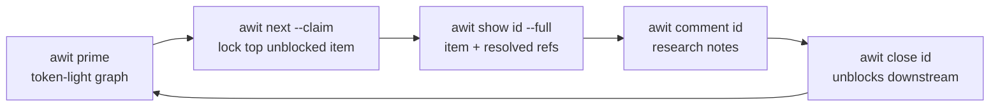
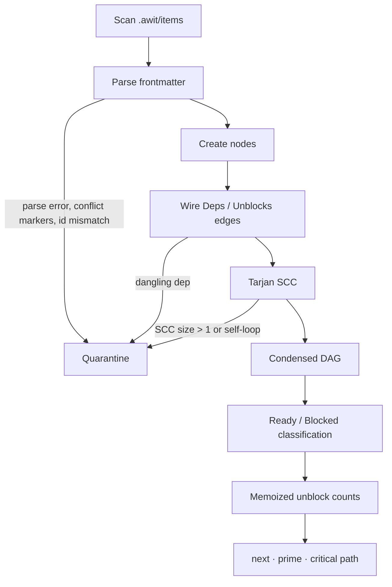

# awit — System Specification & Architecture

**System:** `awit`, a zero-daemon Go CLI that builds a dependency graph from Markdown files in `.awit/` for humans and agents. Versioned in Git; no database, no daemon, no external state.

**Architecture:** Graph-reading commands rebuild the in-memory graph from `.awit/items/*.md` and operate on the condensed DAG. Mutations write only targeted files. Faults (parse errors, cycles, dangling dependencies, conflict markers, ID mismatches, duplicate IDs) route to quarantine.

**Tech Stack:** Go 1.27.1, `github.com/urfave/cli/v3` (CLI), `gopkg.in/yaml.v3` (frontmatter Node editing), `golang.org/x/sys` (`pkg/lock` Windows only), stdlib. External git operations execute via `os/exec`. External trackers interface via pre-authenticated `tea` (Gitea) and `glab` (GitLab) subprocesses.

**On-disk contract:** File format bytes are governed by [schema.md](schema.md), which overrides this document on discrepancy.

---

## Vocabulary

- **Work item** — one Markdown file under `.awit/items/` (ID = filename stem): frontmatter plus body. The unit of work; `item` is the short form and the Go noun.
- **Graph** — the in-memory DAG rebuilt from items on every graph-reading command. Nodes are items; edges are `deps`/`Unblocks`.
- **Ready / Blocked** — derived eligibility, never stored. Ready means not closed, unheld, every dep closed. Blocked means a non-closed item that is held or waiting on deps.
- **Quarantine** — the exclusion set for unreadable or faulted items. Visible everywhere, selectable nowhere.
- **Labels** — free-form grouping sets with no enforced meaning. Any spelling is allowed; `p0`…`p4` may be convention for priority, usable with `-l` filters. Labels carry no scores and enforce no workflow — they group, and flows are built on top.
- **Claim** — a soft reservation (`status`, `assignee`, `claimed_at`, plus a git commit by default), visible across worktrees only after push.
- **Refs** — repo-relative file pointers, resolved by `show --full`.

---

## 1. System Overview

Graph-reading commands parse `.awit/items/*.md`, operate on the memory graph, and persist changes atomically.



### Scope Boundaries
- Local checkout coordination occurs via Git or optional file lock (`.awit/.lock`).
- Local files are canonical. awit has no background or bidirectional tracker sync and no GitHub integration. Gitea and GitLab access occurs only through import, check, body-push, and configured state-push operations.
- No web UI, no multi-repository graphs.

---

## 2. Core Decisions

| Domain | Policy | Rationale |
| --- | --- | --- |
| **ID Scheme** | 40-bit Snowflake: `PREFIX-` + 8 Crockford base32 chars. | Monotonic sort in directory listings; prevents collisions across worktrees. |
| **Priority** | Conventional labels (`p0`, `p1`, …). No dedicated frontmatter field. | Labels stay free-form grouping sets; anyone can filter `p0`…`p4` or invent their own flow without enforced scoring. |
| **`next` Rank** | Transitive unblock count descending; random ties (`math/rand/v2` PCG). `-l` filters candidate set. | Prevents duplicate claims when multiple agents poll concurrently. |
| **`prime` Rank** | Transitive unblock count descending; ties broken by ID ascending. | Deterministic output for prompt caching and snapshot tests. |
| **Frontmatter** | `yaml.v3` Node editing; modifies only changed scalars. | Generates minimal diffs; preserves key order, comments, and unmodeled fields. |
| **Comments** | `<UTC-Timestamp>-<author>.md` (`YYYYMMDDTHHMMSSZ-<author>.md`). Suffix `-2`, `-3` on collision. | Prevents filename collisions across branches without day counters. |
| **Claims** | Soft claim: records `status`, `assignee`, `claimed_at`. Creates Git commit `awit: claim <id>` unless disabled (`--commit=false`, `--no-commit`, or `commit: false` in `config.yaml`). | Invisible across worktrees until pushed. Commits surface competing claims as Git conflicts. Default-on so ticket flow stays traceable in git history; opt out per invocation or per repo when something else owns commits. |
| **Manual Block** | `blocked_reason` string scalar (non-empty = held). A held healthy non-closed item is blocked regardless of deps. | Distinguishes explicit holds from dependency stalls without extra state fields. |

### ID Layout (40 bits)

| Field | Bits | Source |
| --- | --- | --- |
| **Timestamp** | 30 | Seconds since `2026-01-01T00:00:00Z` (~34-year range, rollover 2060). |
| **Worker** | 6 | FNV-1a 32-bit hash of `hostname + worktree_path + branch` mod 64. Overridden by `AWIT_WORKER` (0–63). |
| **Random** | 4 | `crypto/rand`. Re-rolls up to 16 times on local collision (`ErrExhausted`). |

### Fault Handling and Quarantine
One quarantine pipeline processes cycles, dangling dependencies, syntax/parse errors, Git merge conflicts, duplicate IDs (case-insensitive stem match), ID mismatches, and malformed `blocked_reason` values (`PARSE ERROR`).

- Quarantined items are excluded from `next` and critical paths.
- Displayed under `=== GRAPH WARNINGS ===` in `prime`.
- Cause `awit validate` to exit non-zero (`FAIL`).
- Graph-reading commands (`list`, `next`, `prime`, `show`, `validate`, `dep`, `archive`) write a stderr warning if quarantine holds items:
  ```text
  warning: N items quarantined, run awit validate
  ```
  Where `N = len(Quarantined()) + len(Broken)`.

---

## 3. Data Model

Filesystem organization under `.awit/`:

```text
.awit/
├── config.yaml                        # Configuration defaults, labels, templates
├── items/
│   ├── AWIT-0K7M2QX9.md               # One file per work item; filename stem = ID
│   └── AWIT-0K7M3A1F.md
├── comments/
│   └── AWIT-0K7M2QX9/
│       ├── 20260917T143205Z-claude.md # Timestamped comments
│       └── 20260917T151047Z-jan.md
└── archive/                           # Terminal items moved by `awit archive`
    ├── AWIT-0K7LZ9RT.md               # Collapsed item + comments
    └── AWIT-0K7LZ9RT/                 # Relocated --file attachments
        └── 20260916T090000Z-jan.log
```

### Work Item Frontmatter Specification

```markdown
---
id: AWIT-0K7M2QX9
title: Implement OAuth2 bearer token extraction
brief: >-
  The API gateway rejects valid bearer tokens that contain URL-safe base64
  characters. Fix header parsing in the auth middleware and return a
  structured 401 on invalid signatures.
status: in_progress            # open | in_progress | closed
deps: [AWIT-0K7LZ9RT]          # Prerequisite IDs
labels: [auth, api, p1]        # Free-form grouping sets; p0..p4 by convention
assignee: agent/claude
claimed_at: 2026-09-17T14:32:05Z
refs_base: repo                # "repo" (root relative) or absent (legacy items-relative)
refs:
  - .awit/comments/AWIT-0K7M2QX9/20260917T143205Z-claude.md
  - docs/architecture/auth-middleware-spec.md
---
```

### Invariants & Rules

* **IDs:** 40-bit Crockford base32 with prefix (`PREFIX-XXXXXXXX`). Composed of 30-bit timestamp (seconds since 2026-01-01T00:00:00Z), 6-bit worker hash (FNV-1a of hostname + worktree + branch, or `AWIT_WORKER`), and 4-bit random salt.
* **Keys:** Unknown YAML keys are preserved. Empty string or nil fields (`assignee`, `claimed_at`, `alias`, `blocked_reason`, `external`) are omitted on serialization. `deps`, `labels`, and `refs` serialize as empty lists `[]` when unset.
* **Frontmatter Editing:** Performed via `yaml.v3` `*yaml.Node` mutations. Only modified scalars change.
* **Comments & Attachments:** Comments require frontmatter with `author` and `created` (RFC3339 UTC). Files without valid frontmatter are treated as attachments. File naming pattern: `<YYYYMMDDTHHMMSSZ>-<sanitized-author><ext>`, collision suffix `-2`.
* **References:** `refs` store repo-relative forward-slash paths when `refs_base: repo`. Legacy items without `refs_base` default to `.awit/items/` base and migrate to repo-root paths on mutation.

---

## 4. Graph Engine

Rebuilt in-memory by graph-reading commands via condensed DAG construction:



### Graph Algorithms

| Operation | Algorithm | Mechanics |
| --- | --- | --- |
| **Cycle Pre-check** | Directed DFS | Triggered on `dep add A B`. Searches from **B** over `Deps` for **A**. Rejects before write on reachability. |
| **Load Validation** | Tarjan SCC | Identifies strongly connected components of size > 1 or self-loops. Emits cycle path via DFS back-edge traversal. |
| **State Resolution** | Node classification | **Ready:** `status != closed`, no `blocked_reason`, all dependencies `closed`.<br>**Blocked:** `status != closed`, and manually held or has open/dangling/quarantined deps. |
| **Unblock Score** | Directed BFS | Traverses outgoing `Unblocks` edges. Computes count of unique, reachable, non-closed, non-quarantined nodes. Cached on node. |
| **Critical Path** | Dynamic Programming | Longest path over non-closed, non-quarantined nodes in topological order. Ties broken by ID ascending. |

### Archival Engine

`awit archive` computes the maximal fixed-point set: closed, non-quarantined items whose unblock graph contains no non-archived dependants. It inlines comments under `## Comments`, moves attachments to `.awit/archive/<id>/`, rewrites frontmatter references, and deletes source files atomically under lock.

---

## 5. CLI Command Matrix

- Standard flag `--format compact|table|json` applies to tabular outputs (defaults to `compact` if stdout is not a TTY).

| Command | Flags | Target | Description |
| --- | --- | --- | --- |
| `init` | `--prefix`, `--skills`, `--no-skills`, `--force` | Admin | Initializes `.awit/`, `config.yaml`, ignores `.awit/.lock`. Can seed agent skills. |
| `create <title>` | `--brief`, `--body`, `--body-file`, `-d deps`, `-l labels`, `--assign`, `--alias`, `--id`, `--external-*` | Both | Mints ID, validates dependencies, writes work item. |
| `template` | — | Both | Emits configured item body template or fallback skeleton. Builds no graph. |
| `import <url>` | `[--brief]`, `--alias`, `--tea-login` | Both | Imports Gitea (`tea`) or GitLab (`glab`) issue as read-only snapshot. |
| `external check [key]` | `--tea-login` | Both | Detects raw body drift between local item and remote issue. Non-zero exit on drift/error. |
| `external push-body <k>`| `--tea-login` | Both | Writes local body to remote issue via tracker CLI; verifies remote bytes match. |
| `list [key]` | `-s status`, `-l label`, `--ready`, `--blocked`, `--quarantined`, `--format` | Both | Filters and lists graph entries. |
| `label` | `--state open\|closed\|all`, `--format` | Both | Aggregates label frequencies. Ignores graph quarantine warnings. |
| `show <id>` | `--full`, `--refs-only`, `--unblocks` | Both | Displays item metadata, resolved references, or transitive unblocks. |
| `comment <id> [msg]` | `--file <path>`, `--author` | Both | Writes RFC3339-timestamped comment or moves file attachment; updates `refs`. |
| `update <id>` | `--status`, `--brief`, `--body`, `--body-file`, `--assign`, `--label`, `--unlabel`, `--title`, `--alias`, `--clear-alias`, `--external-*`, `--push`, `--no-push`, `--tea-login` | Both | Performs surgical frontmatter mutation. Syncs status to external trackers if enabled. |
| `close <id>` | `--reason`, `--author`, `--push`, `--no-push`, `--tea-login` | Both | Sets `status: closed`, clears `claimed_at` and the hold, keeps `assignee`, appends reason comment. Syncs external status. |
| `release <id>` | `--push`, `--no-push`, `--tea-login` | Both | Resets status to `open`, clears `assignee` and `claimed_at`. Leaves manual hold intact. |
| `block <id>` | `--reason` | Both | Writes `blocked_reason`, sets status to `open`, drops claim. Refuses closed items. |
| `unblock <id>` | — | Both | Deletes `blocked_reason`. Retains status, assignee, and external links. |
| `dep add\|rm <a> <b>` | — | Both | Mutates dependency edge. `add` executes cycle pre-check before writing. |
| `ref add\|rm <id> <p>` | `add --allow-missing` | Both | Mutates reference link. `add` checks target existence unless bypassed. |
| `validate` | `--stale-claims` | Both | Evaluates graph integrity. Exits 1 on quarantine faults. Warns on bad external data. |
| `archive` | `--dry-run` | Human | Consolidates terminal closed items to `.awit/archive/`. |
| `prime` | `--max-tokens`, `-l label` | Agent | Outputs deterministic state graph for agent context injection. |
| `next [key]` | `-l label`, `--claim`, `--agent`, `--commit`, `--no-commit`, `--seed`, `--why` | Agent | Selects highest-impact unblocked item. Optional claim and Git commit. |

Global flags: `--format compact|table|json`, `--repo <dir>`, `--no-color`.

Mutating operations from subdirectories log a single path notice to stderr. Graph commands loading quarantined items print `warning: N items quarantined, run awit validate` to stderr.

### Item Identifiers

Commands accepting `<id>` accept canonical IDs, case-insensitive aliases, or external keys (`owner/repo#N`, `group/sub/project#N`, `#N`). Ambiguity halts execution with matching canonical IDs.

---

## 6. Agent Surfaces

### `awit prime` Output Contract
Deterministic graph snapshot ordered strictly by `UnblockCount` descending, then ID ascending.

```text
=== GRAPH WARNINGS ===
[CYCLE] AWIT-0K7M0A1B -> AWIT-0K7M0C2D -> AWIT-0K7M0A1B (excluded from next)
[DANGLING DEP] AWIT-0K7M0E3F depends on unknown AWIT-0K7M9ZZZ

=== READY (3) ===
[AWIT-0K7M2QX9] Implement OAuth2 token extraction | auth,api,p1 | Unblocks: 4
[AWIT-0K7M3A1F] Update database migration scripts | db | Unblocks: 1
[AWIT-0K7M3B2G] Fix flaky CI job | ci,p2 | Unblocks: 0

=== BLOCKED (2) ===
[AWIT-0K7M4C3H] Add E2E auth tests <- AWIT-0K7M2QX9
[AWIT-0K7M4D4J] Rotate tokens <- AWIT-0K7M2QX9, AWIT-0K7M4C3H | Blocked reason: waiting on keys (awit unblock AWIT-0K7M4D4J)

=== CRITICAL PATH (3) ===
AWIT-0K7M2QX9 -> AWIT-0K7M4C3H -> AWIT-0K7M5E5K
```

#### Token Budgeting Rules (`--max-tokens N`)
Budget estimation uses `len(bytes) / 4`. Budget enforcement is soft with an immutable floor:
1. Warning lines and the first `READY` item are **never shed**, even if they breach the limit.
2. Shedding sequence:
   - Evict `BLOCKED` rows from bottom to top.
   - Evict `READY` rows from bottom to top (stopping at item 1).
   - Evict the `CRITICAL PATH` section entirely.
   - Evict section scaffolding (`(+N more)` counters, section headers).
3. Row counts reflect pre-truncation totals. Negative token limits exit with code 2.

### `awit next` Output Contract
Selects one item from the ready set (ready nodes minus quarantined, filtered by `-l`). An explicit `[key]` is a lookup, not a rerank; with `--claim` the item must be ready, unheld and unclaimed.

```text
[AWIT-0K7M2QX9] Implement OAuth2 token extraction | auth,api,p1 | Unblocks: 4
```

- **Claim Mechanics (`--claim`):** Sets `status: in_progress`, `assignee: agent/<id>`, `claimed_at: now`. If commit policy resolves true, creates Git commit `awit: claim <id>` containing only the item file.
- **Commit Policy Precedence:** Explicit CLI `--commit=true|false` or `--no-commit` > `config.yaml commit:` > default `true`.
- **Identity Resolution:** `--agent` > `AWIT_AGENT` > `config.yaml agent_id`. If unresolved, `--claim` is rejected.
- **Label Filter Logic:** Multiple `-l` flags evaluate as **AND across distinct flags, OR within comma-separated values**: `-l p0 -l auth` must have both; `-l p0,p1` must have either.
- **Diagnostic Mode (`--why`):** Writes one line to stderr:
  ```text
  why: <id>; unblocks=<N>; critical-path=<yes|no>; selection=<max-unblocks|explicit>; tie-break=<none|pcg(seed=<S>,candidates=<K>)>
  ```

---

## 7. Package Layout

```text
cmd/awit            → main: three lines into internal/cli.Main
internal/cli/       → command tree: one file per command, Main(), store/graph helpers
internal/gitx/      → branch, user.name, root, commit via os/exec
internal/teax/      → Gitea `tea` subprocess wrapper
internal/glabx/     → GitLab `glab` subprocess wrapper
internal/skill/     → driving-awit skill assets, Detect, Render
pkg/id/             → snowflake IDs: encode, decode, mint
pkg/config/         → config.yaml load/write, agent resolution
pkg/item/           → frontmatter parse/setters, Store, comments, archive
pkg/graph/          → Build, Tarjan SCC, rank, critical path, archivable
pkg/format/         → compact/table/json entry rendering
pkg/prime/          → deterministic snapshot renderer
pkg/resolver/       → ref resolution from a base directory
pkg/lock/           → advisory .lock (flock / LockFileEx)
```

Exact signatures live in code (`go doc`); this map says where to look. Exit codes: `0` success, `1` expected non-success (`next` with no candidates, `validate` with FAIL, drift/error), `2` usage error.

Writes are temp-then-rename in the target directory; unparseable files never panic — they become `Broken`/quarantined. Output is deterministic: no timestamps, map iteration order, or randomness except the `next` tie-break.
