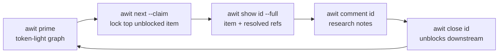
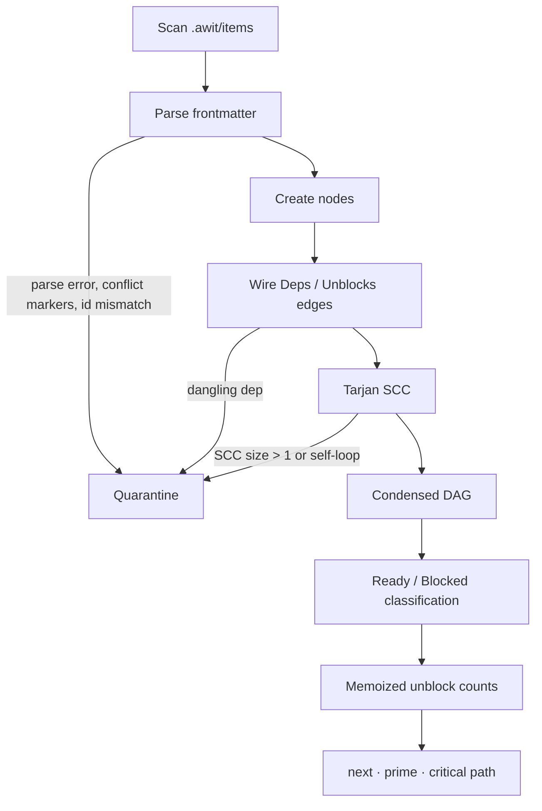
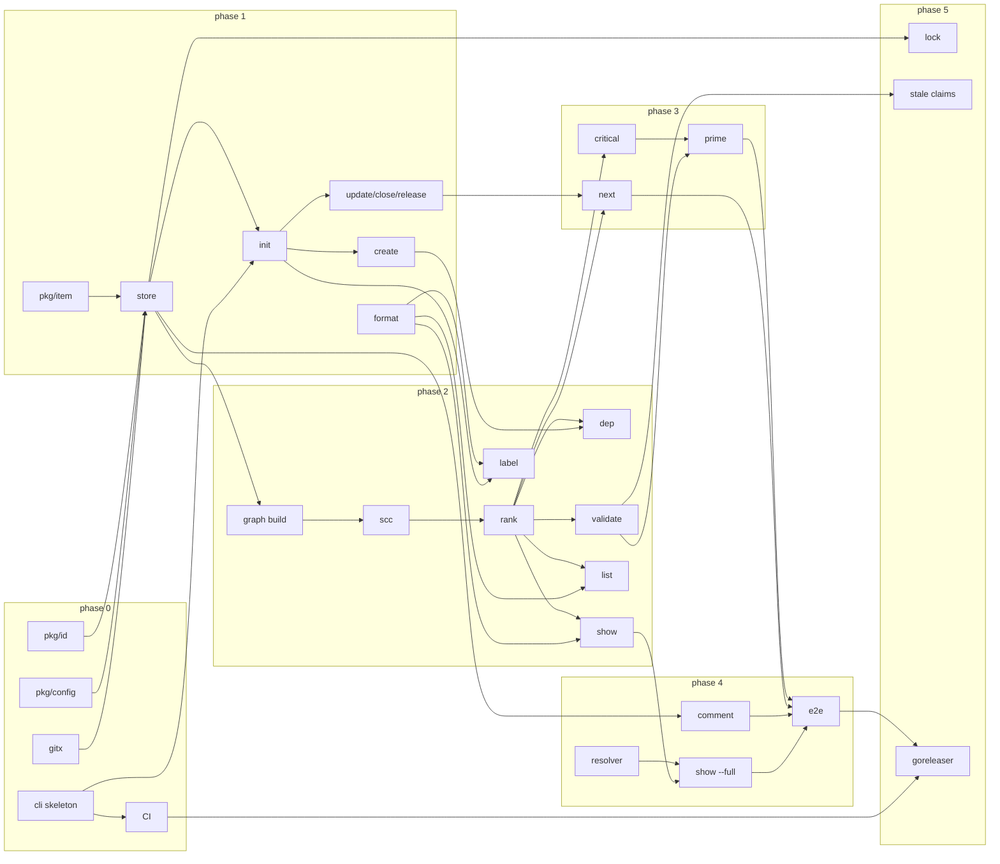

# awit — design spec

> **For agentic workers:** REQUIRED SUB-SKILL: Use superpowers:subagent-driven-development (recommended) or superpowers:executing-plans to work one item at a time. Work items use checkbox (`- [ ]`) steps.

**System:** `awit`, a zero-daemon Go CLI that turns Markdown files under `.awit/` into a dependency graph for humans and agents.

**Architecture:** Graph-reading commands rebuild an in-memory graph from `.awit/items/*.md` and operate on it. Mutations write only their documented files. No database, no daemon, no state outside the files and Git. Faults (parse errors, cycles, dangling deps, conflict markers, id mismatches, duplicate ids) all flow through one quarantine path.

**Tech Stack:** Go 1.27, `github.com/urfave/cli/v3` (CLI), `gopkg.in/yaml.v3` (frontmatter, Node-level editing), stdlib only otherwise. `git` is invoked via `os/exec`, never linked.

**On-disk contract:** The normative on-disk format is [the schema](schema.md). Where this document and the schema disagree about bytes on disk, the schema wins.

**Status:** v1 is delivered. The work items that built it are closed and live in `.awit/archive/`; §9 indexes the phase 0–5 build plus later items in dependency order.

**How to read:** The unnumbered sections below are the design: what awit is and why it is shaped this way. The numbered sections §1–§9 are the implementation contract: exact signatures, conventions and fixtures. This document is the merge of the original implementation plan and the implementation guide; where they disagreed, the guide's resolution stands.

## Overview

awit is a zero-daemon Go CLI that turns Markdown files under `.awit/` into a dependency graph that humans and agents work from — offline, versioned in Git, no database. Graph-reading commands rebuild the graph from `.awit/items/*.md`, so a clone is the whole state and there is nothing to migrate or repair besides text files.

The loop it serves:



Each step is one process invocation; state between steps lives only in the files and in Git.

Out of scope for v1: no web UI, no cross-repo graphs, no coordination beyond a single checkout except through Git itself. Local files are canonical. awit has no background or bidirectional tracker sync and no GitHub integration. Gitea and GitLab access occurs only through import, check, body-push, and configured state-push operations.

## Decisions

Eight decisions are locked. There is no `priority` field, IDs are time-sortable, and every graph fault goes through one quarantine path.

| Decision | Choice | Why |
| --- | --- | --- |
| ID scheme | Snowflake-like, 40 bits, `PREFIX-` + 8 Crockford base32 chars, fixed width | Sequential IDs collide across parallel worktrees; fixed-width base32 sorts chronologically in `ls` |
| Priority | No frontmatter field; priority is a label by convention (`p0`, `p1`, …) | Keeps ranking to one axis; agents ask for priority via `-l` |
| Ranking in `next` | Transitive unblock count desc, ties random; `-l` filters the ready set first | Random ties make two agents racing `next` diverge instead of double-claiming |
| Ranking in `prime` | Unblocks desc, then ID asc — deterministic | Identical state must yield identical bytes for prompt caching and tests |
| Frontmatter writes | `yaml.v3` Node editing; only changed scalars rewritten | `awit update` produces a one-line git diff; unknown keys, order and body stay intact |
| Comment filenames | `<UTC seconds>-<author>.md`, e.g. `20260917T143205Z-claude.md`; `-2` suffix on collision | Per-day sequence numbers collide across branches |
| Claims | Soft claim: writes `status`, `assignee`, `claimed_at`, then commits (`awit: claim <id>`) unless the commit policy says no — `--commit=false`, a true `--no-commit`, or `commit: false` in `config.yaml` | A claim is invisible to other worktrees until pushed; committing makes the double-claim a merge conflict, which quarantine surfaces. Repositories whose orchestrator owns commits opt out once in config instead of per command |
| Manual block | Optional stored `blocked_reason` (non-empty = held); readiness needs no hold plus all deps closed; malformed holds are `PARSE ERROR`. CLI: `block` stores/replaces the reason (open + claim cleared, one save) and refuses closed items; `unblock` removes only it; `release` and non-closing `update --status` preserve it, `close`/closing `update --status` clear it; ranked `next` skips held items, `--claim` refuses them, lookup still prints them; read surfaces carry the reason (`prime` rows, `list`/`next`/`show` views, `blocked_reason` in JSON). `create`/`update`/`import` warn once on stderr when a non-closed item without a hold newly receives the exact label `blocked`; labels stay metadata, never synced | A `blocked` label with zero open deps is unrepresentable otherwise; failing closed keeps unreadable holds unselectable without a new status or quarantine category |

### ID layout

| Field | Bits | Source |
| --- | --- | --- |
| Timestamp | 30 | Seconds since 2026-01-01T00:00Z (~34 years) |
| Worker | 6 | FNV-1a of hostname + worktree path + branch name, mod 64; `AWIT_WORKER` env overrides |
| Random | 4 | `crypto/rand`; re-roll if the file already exists |

Worker hashes the branch name, hostname and worktree path so two clones both on `main` do not share a worker. A per-process sequence counter is meaningless for a one-shot CLI, so the low bits are random and a local collision re-rolls; duplicate IDs across branches are a `validate` check. `create --id` overrides for imports.

### Quarantine

One mechanism covers cycles, dangling deps, unparseable frontmatter, Git conflict markers, duplicate IDs, and ID mismatches. A malformed `blocked_reason` (wrong type, empty content, control characters, duplicate key) is unparseable frontmatter — `PARSE ERROR`, never selectable — not a new category. Quarantined items are excluded from `next`, listed under `=== GRAPH WARNINGS ===` in `prime`, reported as `FAIL` by `validate`, and still visible in `list` and `show` with a flag. The CLI never panics on a bad file. Any command that reads the graph (`list`, `next`, `prime`, `show`, `validate`, `dep`, `archive`) prints one stderr line first — `warning: N items quarantined, run awit validate` — when its initial load holds quarantined items or broken files (N = quarantined nodes plus broken files, same wording for N=1); stdout, exit codes and goldens are untouched, and `label`, which builds no graph, stays silent.

### Paths and platforms

`refs` are stored with forward slashes (`filepath.ToSlash` on write, `FromSlash` on read). Files are written temp-then-rename. CI runs on Linux and Windows from the first commit; `init` gitignores only `.awit/.lock`. It may also write agent skill files outside `.awit/` (see `awit init --skills`); those are project config and are committed, never gitignored.

## Data model

Repository data lives under `.awit/`: YAML config, Markdown items and comments, verbatim attachments, archives, and the lock. Only the lock is uncommitted. Seeded skill files live outside `.awit/` and are committed.

```text
.awit/
├── config.yaml                        # prefix, default_labels, labels, stale_claim, template
├── items/
│   ├── AWIT-0K7M2QX9.md               # one lean item per file, ID = filename
│   └── AWIT-0K7M3A1F.md
├── comments/
│   └── AWIT-0K7M2QX9/
│       ├── 20260917T143205Z-claude.md
│       └── 20260917T151047Z-jan.md
└── archive/                           # written only by `awit archive`
    ├── AWIT-0K7LZ9RT.md               # item + comments collapsed into one file
    └── AWIT-0K7LZ9RT/                 # only when the item had --file attachments
        └── 20260916T090000Z-jan.log
```

Revised item schema:

```markdown
---
id: AWIT-0K7M2QX9
title: Implement OAuth2 bearer token extraction
brief: >-
  The API gateway rejects valid bearer tokens that contain URL-safe base64
  characters. Fix header parsing in the auth middleware and return a
  structured 401 on invalid signatures.
status: in_progress            # open | in_progress | closed
deps: [AWIT-0K7LZ9RT]          # blocked by these IDs
labels: [auth, api, p1]        # priority is a label by convention
assignee: agent/claude
claimed_at: 2026-09-17T14:32:05Z
refs_base: repo
refs:
  - .awit/comments/AWIT-0K7M2QX9/20260917T143205Z-claude.md
  - docs/architecture/auth-middleware-spec.md
---

## Summary
...

## Acceptance Criteria
- ...
```

*The per-key rules — required keys, optional keys, `alias`, `external`, manual blocks, unknown-key preservation and the body — are the on-disk contract and live in [the schema](schema.md).*

*`config.yaml` holds `prefix`, `default_labels`, `labels`, `stale_claim`, `agent_id`, `commit`, `external_push` and `template`; the rules for each key are in [the schema](schema.md).*

### Archive

`items/` grows forever otherwise, and graph-reading commands re-parse all of it. `awit archive` moves finished work out of the hot path without touching the graph engine: an archived item simply no longer exists as far as `Build` is concerned.

That is also the constraint. A closed item `Y` that any remaining item still lists in `deps` would become a `DANGLING DEP` fault on that dependant the moment `Y` leaves `items/`. So the archive set is the **fixed point**: start with every closed, non-quarantined item; repeatedly drop any item that has a dependant outside the set; stop when nothing changes. Items that stay behind are still closed and still satisfy their dependants; they get archived on a later run once their dependants are archivable too. No index file, no "external closed" state in the graph, no rewriting of other items' `deps`.

## Graph engine

Graph-reading commands rebuild the graph, and every graph operation runs on the condensed DAG left after quarantine. Build is O(V+E); hundreds of items resolve in well under 10 ms.



### Operations

| Operation | Algorithm | Notes |
| --- | --- | --- |
| Cycle pre-check on `dep add A B` (A depends on B) | DFS from **B** over `Deps`, looking for **A** | An earlier version searched from A for B, which detects a redundant edge, not a cycle. Record the path for the error message |
| Cycle detection on load | Tarjan SCC | One report per SCC; the DFS back-edge path is used only to print one example chain |
| Ready / Blocked | Inspect `Deps` plus the manual hold | Ready: not closed, no `blocked_reason`, and every dep closed. Blocked: not closed and manually blocked, or any dep open, dangling, or quarantined |
| Unblock score | BFS over `Unblocks`, count unique non-closed nodes | Computed once per build and cached on the node; never inside a sort comparator |
| Critical path | Longest-path DP in topological order | Over non-closed, non-quarantined nodes only; ties broken by ID |

### Error contract

`dep add` refuses before any write:

```text
Error: cannot add dependency AWIT-0K7LZ9RT to AWIT-0K7M2QX9.
Cycle: AWIT-0K7M2QX9 -> AWIT-0K7LZ9RT -> AWIT-0K7M1B4C -> AWIT-0K7M2QX9
```

`validate` reports every quarantine reason with the command that fixes it, exits non-zero on any `FAIL`, and is the intended pre-commit hook.

## CLI command matrix

Twenty commands; there is no `-p` flag anywhere, and every list-shaped output honours `--format compact|table|json` (compact when stdout is not a TTY).

| Command | Flags | User | Purpose |
| --- | --- | --- | --- |
| `awit init` | `--prefix`, `--skills`, `--no-skills`, `--force` | Human | Create `.awit/`, `config.yaml`, gitignore `.awit/.lock`; offer to seed the driving-awit skill |
| `awit create <title>` | `--brief`, `--body`, `--body-file`, `-d deps`, `-l labels`, `--assign`, `--alias`, `--id`, `--external-tracker`, `--external-repo`, `--external-id`, `--external-url` | Both | Mint a snowflake ID, write a lean item; optional Gitea or GitLab mapping; body from `--body`/`--body-file`, else `config.template`, else the built-in skeleton |
| `awit template` | — | Both | Print the body template `create` uses: the `config.yaml` `template:` file's exact bytes, else the built-in skeleton; ignores `--format`; builds no graph, so no quarantine warning |
| `awit import <issue-url>` | `[--brief]`, `--alias`, `--tea-login` | Both | One-time snapshot of a Gitea (`tea`) or GitLab (`glab`) issue; keeps number/iid, exact body, labels, open/closed state; refuses tracker-aware duplicates (active or archived). Omitted `--brief` derives from the remote title (else the body's first sentence, capped at 240 code points); blank title plus empty body exits 1. `--tea-login` is Gitea-only. Labels are copied once as metadata and never synced; a `blocked` label warns on stderr but creates no hold |
| `awit external check [key]` | `--tea-login` | Both | Read-only byte-exact body comparison for linked Gitea (`tea`) or GitLab (`glab`) items; `MATCH`/`DRIFT`/`ERROR` rows plus totals; exit 1 on drift/error. `--tea-login` is Gitea-only |
| `awit external push-body <key>` | `--tea-login` | Both | Explicit local-canonical repair: pushes body bytes (Gitea via `tea`, GitLab via `glab`), refuses ambiguous links and GitLab quick-action bodies, verifies the remote bytes |
| `awit list [key]` | `-s status`, `-l label`, `--ready`, `--blocked`, `--quarantined`, `--format` | Both | Index view; `[key]` selects exactly one item |
| `awit label` | `--state open\|closed\|all`, `--format` | Both | Label vocabulary with usage counts; answers "what labels exist and how busy are they" |
| `awit show <id>` | `--full`, `--refs-only`, `--unblocks` | Agent | Core item (~200 tokens), full resolved ref tree, or the open items this one transitively unblocks |
| `awit comment <id> [text]` | `--file <path>`, `--author` | Both | Write a timestamped comment or attach an external file; append to `refs` |
| `awit update <id>` | `--status`, `--brief`, `--body`, `--body-file`, `--assign`, `--label`, `--unlabel`, `--title`, `--alias`, `--clear-alias`, `--external-tracker`, `--external-repo`, `--external-id`, `--external-url`, `--clear-external`, `--push=true\|false`, `--no-push`, `--tea-login` | Both | Mutate frontmatter with a minimal diff; an explicit `--status` also pushes the mapped state (`closed`→closed, `open`/`in_progress`→open) to the linked Gitea or GitLab issue unless `external_push: false` or `--push=false`/`--no-push`; local-first with a stderr retry warning on remote failure |
| `awit close <id>` | `--reason`, `--author`, `--push=true\|false`, `--no-push`, `--tea-login` | Both | Set `closed`, clear `claimed_at` and any manual block, append reason as a comment; pushes `closed` to the linked Gitea or GitLab issue unless `external_push: false` or `--push=false`/`--no-push` |
| `awit release <id>` | `--push=true\|false`, `--no-push`, `--tea-login` | Both | Reopen an in-progress or closed item to `open`, clear `assignee` and `claimed_at`; any manual block stays; prints `reopened <id>` (plain line, ignores `--format`); pushes `open` to the linked Gitea or GitLab issue unless `external_push: false` or `--push=false`/`--no-push` |
| `awit block <id>` | `--reason` | Both | Pause an item with a recorded reason: store/replace `blocked_reason`, set `open`, clear the claim in one save; refuse closed items; plain `blocked <id>: <reason>` line; never touches git or the tracker |
| `awit unblock <id>` | — | Both | Remove only the manual block; never claims, reopens, or pushes; idempotent; plain `unblocked <id>` line |
| `awit dep add\|rm <id> <dep>` | — | Both | Edit `deps` with cycle pre-check |
| `awit ref add\|rm <id> <path>` | `add --allow-missing` | Both | Add or remove a repo-root-relative file reference; `add` refuses a missing target (exit 1, no write) unless `--allow-missing` is given; does not copy, delete, or commit |
| `awit validate` | `--stale-claims` | Both | Integrity report; non-zero exit on `FAIL`; invalid `external` is a WARN |
| `awit archive` | `--dry-run` | Human | Move the fixed-point set of closed items to `.awit/archive/`, one collapsed file each |
| `awit prime` | `--max-tokens`, `-l label` | Agent | Deterministic state graph for prompt injection |
| `awit next [key]` | `-l label`, `--claim`, `--agent`, `--commit=true\|false`, `--no-commit` (deprecated), `--seed`, `--why` | Agent | Top unblocked item or exact lookup; optional claim; `--why` explains the pick on stderr |

Global flags: `--format`, `--repo <path>` (locate `.awit/` explicitly instead of walking up), `--no-color`.

Every `<id>` argument (and `dep`/`create -d` values) accepts a canonical ID (exact, wins), an alias (case-insensitive), or an external key `owner/repo#<n>` / `group/sub/project#<n>` / unique bare `#<n>`; ambiguity (including the same repo and number on two trackers or hosts) is an error naming the canonical IDs.

## Agent surface

`prime` is a deterministic snapshot; `next` is a possibly-random pick. Both show labels and unblock counts and nothing about priority beyond what the labels say.

### `awit prime`

```text
=== GRAPH WARNINGS ===
[CYCLE] AWIT-0K7M0A1B -> AWIT-0K7M0C2D -> AWIT-0K7M0A1B (excluded from next)
[DANGLING DEP] AWIT-0K7M0E3F depends on unknown AWIT-0K7M9ZZZ

=== READY (3) ===
[AWIT-0K7M2QX9] Implement OAuth2 token extraction | auth,api,p1 | Unblocks: 4
[AWIT-0K7M3A1F] Update database migration scripts | db | Unblocks: 1
[AWIT-0K7M3B2G] Fix flaky CI job | ci,p2 | Unblocks: 0

=== BLOCKED (2) ===
[AWIT-0K7M4C3H] Add E2E auth tests <- AWIT-0K7M2QX9
[AWIT-0K7M4D4J] Rotate tokens <- AWIT-0K7M2QX9, AWIT-0K7M4C3H

=== CRITICAL PATH (3) ===
AWIT-0K7M2QX9 -> AWIT-0K7M4C3H -> AWIT-0K7M5E5K
```

Rules:

- Ready sorted by unblocks desc, then ID asc; blocked sorted by ID. No timestamps, no randomness, so identical state yields identical bytes.
- Warnings section is omitted when empty; counts in headers let the agent see truncation.
- `--max-tokens N` budgets at ~4 chars per token (soft budget with a mandatory floor): shed BLOCKED rows from the end, then READY rows from the end (never the first), then the critical-path section as a whole, then scaffolding (empty sections, the `(+N more)` notice, READY/BLOCKED headers, finally the warnings heading). Kept rows are prefixes; counts stay post-filter/pre-truncation. Warning detail lines and the top READY row are never shed — when even they exceed N, `prime` emits them anyway. Negative budgets are usage errors (exit 2).
- `-l label` restricts ready and blocked to items carrying that label (repeatable).

### `awit next`

Output is one compact line, or JSON with `--format json`:

```text
[AWIT-0K7M2QX9] Implement OAuth2 token extraction | auth,api,p1 | Unblocks: 4
```

- Candidate set = ready items minus quarantined, filtered by `-l`; ranked by unblocks desc; ties broken by `math/rand/v2` seeded from time, or from `--seed` in tests.
- Empty candidate set exits 1 with `No ready items` (and the active label filter) so a loop can stop cleanly.
- `--claim` sets `status: in_progress`, `assignee: agent/<id>`, `claimed_at: now`, writes the file, and commits `awit: claim <id>` touching only that file. The commit follows the policy: explicit `--commit=true|false` or a true `--no-commit` (deprecated) beats `config.yaml commit:` which beats the default `true`; `--no-commit=false` is neutral; passing both `--commit` and a true `--no-commit`, or a non-bool `--commit` value, is usage error 2 before any write. Without `--claim` the policy flags write and commit nothing.
- Agent identity: `--agent`, else `AWIT_AGENT`, else `config.agent_id`; none → refuse `--claim`.
- `--why` prints one stderr line after a successful pick or claim, stdout byte-identical: `why: <id>; unblocks=<N>; critical-path=<yes|no>; selection=<max-unblocks|explicit>; tie-break=<none|pcg(seed=<S>,candidates=<K>)>`. `K` is the equal-maximum group after label filtering (`K=1` → `none`); the printed seed replays the tie-break. Exact lookups report `selection=explicit`. No line on failed selection, refused claim, or empty candidates.

The intended priority check is `awit next -l p0` without `--claim`: it answers whether anything critical is ready and how much it unblocks, and the agent decides from there.

## Delivery phases

Six phases; phases 1–2 set the codebase's shape, and the agent surface waited until `validate` was trustworthy.

| Phase | Scope | Exit criterion |
| --- | --- | --- |
| 0 | Skeleton, config, ID minting | `awit init` and `awit --version` pass on Linux and Windows CI |
| 1 | Item store, human CLI, formatters | Round-trip test byte-identical; `update --status` diff is one line |
| 2 | Graph core, `dep`, `validate` | Fixture repos produce exactly the expected `PASS`/`FAIL` lines |
| 3 | `prime`, `next`, critical path | Two `prime` runs on identical state produce identical bytes |
| 4 | Comments, resolver, `show --full` | Agent loop runs end to end against a fixture |
| 5 | Locking, stale claims, hooks, release | Tagged binaries for linux/windows/darwin via goreleaser |

*All six phases are delivered; the lists below record the scope each phase covered.*

### Phase 0 — skeleton

- `go mod init` with layout `cmd/awit`, `pkg/{item,graph,resolver,format,id}`
- `urfave/cli` v3 root command, `--format`, `--repo`, `--no-color`; TTY detection for the default format
- `pkg/id`: base32 encode/decode, worker hash, minting; property test that IDs sort by creation time
- `config.yaml` load with defaults; `AWIT_AGENT` / `AWIT_WORKER` env handling
- GitHub Actions CI matrix: linux + windows, `go vet`, `staticcheck`, tests

### Phase 1 — item store and human CLI

- `pkg/item`: frontmatter split, `yaml.v3` Node parse, targeted scalar rewrite, body kept as raw bytes
- Round-trip test: parse → write must be byte-identical on every fixture; fuzz the splitter
- `store.go`: scan, load all, atomic write (temp + rename), filename/ID consistency check
- Commands: `init`, `create` (optional `config.template` body file), `list`, `show` (default view), `update`, `close`, `release`
- Formatters `compact`, `table`, `json` with golden files and an `-update` flag

### Phase 2 — graph core

- `Build` with dangling-dep detection and parse-error carry-through
- Tarjan SCC → quarantine set; example chain via DFS back edge
- Ready/blocked classification; memoized transitive unblock counts
- `dep add` with cycle pre-check (DFS from the new dependency toward the dependant); `dep rm`
- `validate` with all quarantine reasons, fix-it hints, non-zero exit
- `testdata/` fixtures: clean, cyclic, dangling, conflicted, duplicate-id, id-mismatch

### Phase 3 — agent surface

- Ranking: unblocks desc, ID tie-break for `prime`, seeded random tie-break for `next`
- `-l` filtering on both commands
- Critical path via longest-path DP on the condensed DAG
- `prime` renderer with section ordering, counts, `--max-tokens` truncation
- `next --claim`: frontmatter write, `claimed_at`, git commit via `os/exec`, `--no-commit`
- Determinism test: identical fixture → identical `prime` bytes across two runs and two OSes

### Phase 4 — progressive disclosure

- `comment` inline and `--file`; timestamped filenames with collision suffix; `refs` append (`.awit/comments/<id>/…`)
- `pkg/resolver`: relative-path resolution from a caller-chosen base directory (repo root or `.awit/items/`), slash normalisation, missing-file reporting
- `show --full` with delimiter headers per ref; `--refs-only`; cycle-safe if a ref points at another item; `ref add`/`rm`
- End-to-end test running the five-step loop against a fixture repo
- `ref add` existence check: stat the resolved target before any mutation, `--allow-missing` opt-out when the target does not exist yet.

### Phase 5 — hardening

- Optional `.awit/.lock` (flock / LockFileEx) for same-checkout concurrency
- `validate --stale-claims` using `config.stale_claim`
- Documented pre-commit hook running `awit validate`
- goreleaser config, version embedding, `README` with the agent loop
- `init --skills`: detect `.claude`, `.omp`, `.opencode`, `.agents`, `.pi` and offer to seed the driving-awit skill from an embedded asset
- Structured `external:` Gitea or GitLab mapping (`tracker`, `repo`, issue `id`/`iid`, `url`); invalid values warn, do not quarantine
- GitLab remote access through the concrete `internal/glabx` wrapper only (pre-authenticated `glab` 1.118.0 subprocess: verified byte-exact description writes, `state_event` close/reopen, column-zero quick-action refusal). No shared transport/provider framework, no login management, no MRs, no body rewriting. `awit import` accepts GitLab issue and work_items URLs; `external check` / `push-body` route by tracker to tea or glab
- `archive`: fixed-point eligibility, comment collapse, attachment move, `--dry-run`; `validate` stays `PASS` afterwards

## 1. Global constraints

Every work item inherits these. Copy them into your head before you start.

- Module path: `github.com/eisenwinter/awit`. Binary: `cmd/awit`. Go `1.27.1` as in `go.mod`.
- Dependencies allowed: `github.com/urfave/cli/v3`, `gopkg.in/yaml.v3`. Nothing else without a work item saying so. (`golang.org/x/sys` is allowed only in `pkg/lock` for Windows `LockFileEx`.)
- Must compile and pass `go vet`, `staticcheck`, and `go test ./...` on **Linux and Windows**. Never hardcode `/` in filesystem paths; use `filepath`. `refs` inside frontmatter are always forward slashes (`filepath.ToSlash` on write, `filepath.FromSlash` on read).
- Every file write is temp-then-rename in the same directory (`os.CreateTemp(dir, ".tmp-*")`, write, `Close`, `os.Rename`). No exceptions.
- The CLI **never panics on a bad file**. Any file that cannot be parsed becomes a quarantine fault and the command continues.
- Output that is compared in tests (`prime`, `compact`, `validate`) is **deterministic**: no timestamps, no map iteration order, no randomness unless the command is explicitly random (`next` tie-break only).
- Errors go to stderr, prefixed `Error: `. Exit codes: `0` success, `1` expected non-success (`next` with no candidates, `validate` with FAIL, cycle refused), `2` usage error (urfave default).
- No colour anywhere in v1 output; `--no-color` is accepted and is a no-op that exists so scripts written today keep working.
- Commit after every green step. Commit message format: `<scope>: <imperative summary>` where scope is the package or command (`id: add base32 codec`, `cli/next: seeded tie-break`).
- Tests: `testing` stdlib only, table-driven, `t.TempDir()` for filesystem. Golden files under `testdata/golden/` with an `-update` flag (`var update = flag.Bool("update", false, "rewrite golden files")`). Fixtures under `testdata/fixtures/<name>/.awit/…`.
- Do not run formatters/linters project-wide inside a work item beyond `gofmt` on files you touched; CI runs `go vet` and `staticcheck` once. `go build ./... && go vet ./... && go test ./...` still runs project-wide before closing (see §7).

## 2. Resolved decisions

Six questions were left open by the original plan. They are decided here so no work item has to guess; change them only by editing this section first.

| # | Question | Decision |
| --- | --- | --- |
| 1 | Multiple `-l` flags on `next`/`prime`/`list` | **AND across flags, OR within a flag.** `-l p0 -l auth` = items with `p0` **and** `auth`. `-l p0,p1` = items with `p0` **or** `p1`. Parsed into `[][]string` by `cli.SplitLabels`. |
| 2 | Worker hash input | **hostname + worktree absolute path + branch name**, FNV-1a 32-bit, `% 64`. `AWIT_WORKER` (0–63) overrides. Branch missing (not a git repo) → empty string, still hashed. |
| 3 | Does `close` commit? | **No.** Only `next --claim` commits. `close` is a plain file write; the human or agent commits when they are done. |
| 4 | Comment author source | `--author` flag → `AWIT_AGENT` env → `config.agent_id` → `git config user.name` (spaces replaced by `-`, lowercased) → error `Error: no author; pass --author or set AWIT_AGENT`. Agents get `agent/<name>` prefix only when the value came from `AWIT_AGENT`/`agent_id`; `--author` and git name are used verbatim. |
| 5 | Token estimate for `--max-tokens` | **`len(bytes)/4`**, integer division. Documented as approximate. No tokenizer dependency. The budget is **soft with a mandatory floor**: warning detail lines and the top ready row (when one exists after filtering) are never shed; when even they exceed N, `prime` emits them anyway. |
| 6 | ID epoch and width | **Keep**: epoch `2026-01-01T00:00:00Z`, 30-bit seconds, 6-bit worker, 4-bit random, 8 Crockford chars. Rolls over in 2060. `Encode` returns an error if timestamp exceeds 30 bits. |

Additional decisions made while writing work items:

| Topic | Decision |
| --- | --- |
| CLI package layout | Commands live in `internal/cli/`, one file per command. `cmd/awit/main.go` is three lines. |
| Item body template on `create` | Default `\n## Summary\n\n## Acceptance Criteria\n\n` (leading newline separates from closing `---`). Optional `config.yaml` `template:` is a repo-root-relative forward-slash path; `create` copies that file's exact bytes as the body (no extra leading newline; empty file → empty body). Absent/empty keeps the skeleton. Absolute paths and lexical `..` escape fail config load. Missing/unreadable/directory/non-UTF-8/conflict-marker files fail create before mint. Body-only: not parsed as frontmatter. `import` never reads it. |
| Frontmatter key order for new items | `id, title, brief, status, deps, labels, assignee, claimed_at, refs_base, refs`. Keys with empty values (`assignee`, `claimed_at`) are **omitted** on create and **deleted** from the mapping when cleared. `deps`, `labels`, `refs` are always present, `[]` when empty. `refs_base: repo` is written immediately before `refs`. Absence of `refs_base` means historical `.awit/items/`-relative refs. |
| Sequence style | `deps` and `labels` are written flow style `[a, b]`. `refs` is written block style (one `- path` per line) because paths are long. When editing an existing item, the existing node's style is preserved. |
| `brief` style | Written as `>-` folded scalar (`yaml.FoldedStyle`) when it contains a newline or is longer than 80 chars, plain otherwise. |
| `claimed_at` format | `time.RFC3339` in UTC, seconds precision. |
| Comment file format | Frontmatter `author`, `created` (RFC3339 UTC) then blank line then the text. Attached files (`--file`) are copied verbatim, no frontmatter. |
| `awit label` semantics | `--state open` (default) counts items whose status is **not** `closed` (so `open` + `in_progress`); `--state closed` counts only closed; `--state all` counts every parseable item. Quarantined items are counted (they still carry labels); unparseable files are not. Rows sorted by count desc, then label asc. Optional `config.yaml` `labels` is an advisory vocabulary (missing/empty disables). `create`/`update` warn on unknown names they introduce but still store them; matching is case-sensitive. `awit label` still counts actual use: used undeclared labels appear, unused declared names do not. |
| Comment filename | `<YYYYMMDDTHHMMSSZ>-<author>.md`; author sanitised to `[a-z0-9._-]` (others → `-`, `agent/` prefix stripped). Collision → `-2`, `-3`, … before `.md`. `--file` keeps the original extension. |
| Duplicate ID definition | Two files in `items/` whose stems are equal case-insensitively (`strings.EqualFold`). Both are quarantined `DUPLICATE ID`. |
| `next` tie-break | `math/rand/v2` with `rand.NewPCG(seed, seed)`; seed from `--seed` if set else `time.Now().UnixNano()`. Shuffle only within equal-unblock groups. |
| `next --why` | One stderr line after a successful pick/claim: `why: <id>; unblocks=<N>; critical-path=<yes\|no>; selection=<max-unblocks\|explicit>; tie-break=<none\|pcg(seed=<S>,candidates=<K>)>`. `K` is the equal-maximum group after label filtering; exact lookups use `selection=explicit`. No line on failed/refused/no-ready exits; stdout byte-identical with or without it. |
| Unblock count | Number of **unique, non-closed, non-quarantined** nodes reachable via `Unblocks` edges (transitive). Quarantined nodes have `UnblockCount == -1`. |
| Critical path | Longest path (by node count) over non-closed, non-quarantined nodes following `Unblocks` edges in topological order; ties by smaller ID at each DP step. Printed from the root (item with no open deps) downstream. |
| `--repo` semantics | Path to the directory that **contains** `.awit/`. Precedence: `--repo` flag → `AWIT_REPO` env → walk up from cwd until a directory containing `.awit/` is found; stop at filesystem root with `Error: no .awit directory found (run awit init)`. A mutating command (`create`, `update`, `close`, `release`, `dep`, `ref`, `comment`, `archive`, `next --claim`) that walked up — no flag, no env, no `.awit/` in cwd — prints one line on stderr: `Note: no .awit in the current directory; using <root>. Run awit init here, or pass --repo / set AWIT_REPO.` Read-only commands stay silent. |
| Git commit on `--claim` | `git -C <root> add <itemfile>` then `git -C <root> commit -m "awit: claim <id>" -- <itemfile>`. Commit failure is an error **after** the file was written; message tells the user the file is claimed but uncommitted. Whether the commit happens follows the **claim commit policy** (AWIT-0NHDC5DZ): an explicit `next --commit=true\|false` or a true `--no-commit` (deprecated spelling of `--commit=false`, still accepted, no runtime warning) beats `config.yaml commit:` which beats the default `true`; `--no-commit=false` is neutral; `--commit` plus a true `--no-commit`, or a non-bool `--commit` value, is usage error 2 before any mutation. The policy governs only this claim commit — never pushing, `close`, `release`, or any other command. |
| Archive eligibility | Fixed point over the graph: start with every closed, non-quarantined node; repeatedly remove any node with an `Unblocks` neighbour outside the set (open, quarantined, or closed-but-not-in-set); stop when stable. Result sorted by ID. Never rewrites another item's `deps`, never introduces an index file; the graph engine is unchanged. |
| Archive layout | Flat `.awit/archive/<id>.md`, same depth as `items/`. After `refs_base: repo`, non-comment refs (`docs/plan/x.md`) stay valid independent of archive directory depth. `--file` attachments move to `.awit/archive/<id>/<file>`; their ref becomes `.awit/archive/<id>/<file>`. |
| Comment collapse format | The archived item is a node-edit after NormalizeRefs — drop comment refs and missing comment-prefix refs, rewrite attachment refs, keep other keys and the body — then `\n## Comments\n` and one `\n### <created RFC3339 UTC> <author>\n\n<text>\n` block per comment, ordered by comment filename asc (chronological). Comment refs (`.awit/comments/<id>/…` with frontmatter `author`+`created`, or historical `../comments/<id>/…`) are removed from `refs`; all other frontmatter untouched (node edit, unknown keys kept). No `archived_at` key — Git records when. Items with zero comments get no `## Comments` section. |
| Comment vs attachment | A file under `comments/<id>/` is a **comment** when `Split` succeeds and the frontmatter has `author` and `created`; every other file is an **attachment** (verbatim `--file` copy) and is moved, never inlined. No MIME sniffing. |
| Archive write order | Per item: write `archive/<id>.md` atomically → move attachments (`os.Rename`, atomic write fallback on cross-device) → `os.Remove(items/<id>.md)` → `os.RemoveAll(comments/<id>)`. Idempotent: if both `archive/<id>.md` and `items/<id>.md` exist (crash between steps) the archive file is rebuilt from `items/` and overwritten. |
| Does `archive` commit? | **No**, same as `close`. Holds `Store.Lock`. Output ignores `--format` (like `close`): one `archived <id>` line per item, sorted by ID, then `Archived N items`. `--dry-run` writes nothing, prints `would archive <id>` lines and `skip <id>: dependant <dep-id> not archivable` for every closed item left behind, then `Would archive N items`. Exit 0 even when N = 0. |
| Release output | **No commit**, same as `close`. Holds `Store.Lock`. Every source state — `open`, `in_progress`, `closed` — ends `open` with `assignee`/`claimed_at` deleted, so release is an idempotent visible action. Output ignores `--format` (like `close` and `archive`): exactly one `reopened <id>` line, printed only after `Store.Save` succeeds; load/write failures print no success line. |
| `external` mapping | Optional Gitea or GitLab link: `{tracker: gitea\|gitlab, repo, id, url}`. `id` is the Gitea issue number or GitLab iid. Gitea `repo` is two segments; GitLab `repo` is two or more (subgroups allowed). GitLab URLs end in `/<repo>/-/issues/<iid>` or `/<repo>/-/work_items/<iid>` with an optional installation prefix. Local statuses stay `open\|in_progress\|closed`; GitLab wire `opened` maps to local `open` (remote conversion, not YAML). `create`/`update` require `--external-tracker`, `--external-repo`, `--external-id`, `--external-url` together (partial → exit 2, no write). `update --clear-external` is mutually exclusive with those flags. Invalid or legacy scalar `external:` values set `ExternalProblem` and are **not** quarantined; `validate` prints `WARN  <id>: invalid external: <reason>` (JSON: that line on stderr; fault-array schema unchanged). Exit 0 unless graph faults exist. |
| `external` state push | One-way local→remote propagation, dispatched by tracker (Gitea via `tea`, GitLab via `glab` as `state_event` reopen/close). `close`→`closed`, `release`→`open`, explicit `update --status closed`→`closed`, `update --status open\|in_progress`→`open`; a non-status update, `next --claim`, create, import, comment, ref, and archive never push. Optional `config.yaml external_push:` (omitted → true; independent of `commit`) is the repository default. All three carry `--push=true\|false` (value-based; empty unset; ParseBool spellings) and `--no-push` (kept, not deprecated; `--no-push=false` is neutral) plus `--tea-login` (Gitea-only, ignored for GitLab). Precedence: explicit `--push` or true `--no-push` > config > default true. `--push` plus true `--no-push`, or a non-bool `--push`, is usage error 2 before any mutation. Policy is resolved after openStore and before any setter/Save. Local save first (keeping close's reason/comment and claim-clearing), then `Client.SetState` under the held store lock with the bounded subprocess deadline when the resolved policy is true. A config-only skip of a linked or malformed-linked item prints `warning: <id> saved locally; external state push skipped by config external_push: false; push with awit update <id> --status <status> --push=true` after the local save and before duplicate-link validation, tool discovery, auth, or network; explicit `--push=false` or true `--no-push` is silent; unlinked items are silent. Remote failure, a missing tool, invalid metadata, or ambiguous links keep the local mutation and confirmation, print one stderr `warning: <id> saved locally; external state push failed: <reason>; retry with awit update <id> --status <status>`, and exit 0; local failure exits 1 with no push. Same-status `update --status` repeats the push (the retry path). Response identity/state and HTTP status are validated; remote state is never GET-read to decide. No retries, queues, or commits. Explicit `external push-body`, import reads, and `external check` are unaffected. |
| `ref add` existence check | `ref add` stats the resolved repo-root-absolute target before any mutation; a missing target exits 1 naming the absolute path with no write unless `--allow-missing` is given. `NormalizeRefs`, `Save`, `update`, import, archive and `ref rm` never check existence; read-time `[missing]` reporting is unchanged. |
| Manual block | Optional stored `blocked_reason` string (non-empty = held) excludes healthy non-closed nodes from Ready in `Graph.classify`; labels alone never hold; malformed declarations are `PARSE ERROR` (fail closed). No new status, no quarantine category, no edges. CLI: `block` stores/replaces the reason (open + claim cleared, one save), `unblock` removes only it; `release` and non-closing `update --status` preserve it, `close`/closing `update --status` clear it; ranked `next` skips held items and `--claim` refuses them. `create`/`update`/`import` print one stderr warning when a non-closed item without a hold newly receives the exact label `blocked` (stdout/exit unchanged; labels stay metadata, never synced) |
| `import --brief` default | Omitted (or empty) `--brief` on `import` derives after fetch validation and before the mutation lock: the normalized remote title when it holds any non-whitespace rune, else the body's first sentence (`.`/`!`/`?` followed by whitespace or end-of-source, the `sentenceCount` boundary; newlines alone never split). Normalization trims outer Unicode whitespace and collapses each inner run to one ASCII space. Derived values cap at 240 Unicode code points (first 239 runes minus trailing space plus U+2026). Explicit text is verbatim and uncapped; a blank remote title is stored unchanged. Blank title plus empty body with no override exits 1 before mint/save. `create --brief` stays required. |
| `awit template` | Prints the `config.yaml` `template:` bytes, else `item.DefaultBody`. Builds no graph, so no quarantine warning; ignores `--format`. Shares `readTemplateBody` with `create`. |
| `create`/`update` body flags | `--body` (verbatim text) and `--body-file` (`PATH` or `-` for stdin) are mutually exclusive, validated for UTF-8 and conflict markers, and resolved before the lock and mint. Precedence: flags > `config.template` > `item.DefaultBody`. `--body ""` is indistinguishable from unset and falls through to `config.template`; an empty body is reachable only via `--body-file` naming an empty file. `update` adds `body == nil` to its `nothing to update` guard. |
| `show --unblocks` | Own view like `--refs-only`; refuses combination with `--full`/`--refs-only` (exit 2). Renders `graph.ReachableUnblocks` through `format.Write`, so `--format` works. Empty set prints no rows, exit 0 (compact: nothing; table: header only; json: `[]`). Inserted before the JSON branch, so `--format json` emits a bare entry array. |

## 3. Repository layout

```text
cmd/awit/main.go                 → internal/cli.Main()
internal/cli/
  app.go                         root *cli.Command, global flags, Main(), helpers (openStore, exitf, SplitLabels)
  init.go create.go template.go import.go list.go label.go show.go comment.go update.go close.go release.go block.go dep.go ref.go external.go validate.go prime.go next.go archive.go
  *_test.go                      command tests drive Main() with args and capture stdout/stderr
internal/teax/teax.go            concrete `tea` subprocess wrapper (no provider interface, no HTTP client)
internal/glabx/glabx.go           concrete `glab` subprocess wrapper (no provider interface, no HTTP client)
internal/glabx/glabxtest/         portable glabstub installer for subprocess tests
internal/glabx/testdata/glabstub/ fake `glab`: scripted config/api, nonzero exit on HTTP errors
internal/skill/skill.go          Targets, Detect, Render; assets/ holds the embedded driving-awit body and frontmatter
pkg/id/id.go                     snowflake IDs
pkg/config/config.go             config.yaml
pkg/item/
  item.go                        Item, Parse, setters, Bytes
  frontmatter.go                 Split, conflict-marker detection
  store.go                       Store: Find/Open/Init/LoadAll/Load/Save/Mint/Lock
  comment.go                     AddComment, AttachFile, CommentFileName, SanitizeAuthor, Comments (parse comments/<id>/)
  archive.go                     Store.Archive: collapse + move + delete
  reason.go                      Reason constants, Broken
pkg/graph/
  graph.go                       Node, Fault, Graph, Build
  scc.go                         Tarjan, example chain
  rank.go                        Ready/Blocked/Quarantined, FilterLabels, WouldCycle, Archivable
  critical.go                    CriticalPath
pkg/format/format.go             Format, Detect, Entry, Entries, Entry rendering (compact/table/json)
pkg/prime/prime.go               Render
pkg/resolver/resolver.go         Resolve
pkg/lock/lock.go lock_unix.go lock_windows.go
testdata/fixtures/<name>/.awit/  clean, cyclic, dangling, conflicted, duplicate-id, id-mismatch, parse-error, loop (for E2E)
testdata/golden/                 *.golden
.github/workflows/ci.yml
.goreleaser.yaml
```

## 4. Shared interfaces

These are the exact names later work items consume. Implement them with these signatures. If you must add a method, add it; never rename or change a signature listed here without updating this document and every work item that references it.

### 4.1 `pkg/id`

```go
package id

const Alphabet = "0123456789ABCDEFGHJKMNPQRSTVWXYZ" // Crockford, uppercase
var Epoch = time.Date(2026, 1, 1, 0, 0, 0, 0, time.UTC)
const (
    TimestampBits = 30
    WorkerBits    = 6
    RandomBits    = 4
    Chars         = 8 // 40 bits / 5
)

// Encode packs the three fields into 8 uppercase Crockford chars, MSB first.
// Returns error if any field exceeds its width.
func Encode(secs uint32, worker uint8, rnd uint8) (string, error)

// Decode is the inverse of Encode. Accepts lowercase; rejects I, L, O, U and wrong length.
func Decode(s string) (secs uint32, worker uint8, rnd uint8, err error)

// Format joins prefix and encoded body: "AWIT-0ND5683G".
func Format(prefix, body string) string

// Split returns prefix and body from "PREFIX-BODY"; error if no dash or body length != 8.
func Split(s string) (prefix, body string, err error)

// Valid reports whether s is "<prefix>-<8 valid chars>" for the given prefix.
func Valid(prefix, s string) bool

// Time returns the mint time of an ID body (UTC).
func Time(body string) (time.Time, error)

// WorkerFor hashes hostname+worktree+branch with FNV-1a 32 and returns % 64.
func WorkerFor(hostname, worktree, branch string) uint8

// Worker returns AWIT_WORKER if set and in 0..63, else WorkerFor(os.Hostname(), worktree, branch).
func Worker(worktree, branch string) uint8

// Mint builds an ID for now with a random low nibble, retrying while exists(id) is true.
// Fails after 16 attempts with ErrExhausted. now is truncated to seconds, converted to UTC.
func Mint(prefix string, now time.Time, worker uint8, exists func(string) bool) (string, error)

var ErrExhausted = errors.New("id: could not mint unique id after 16 attempts")
```

### 4.2 `pkg/config`

```go
package config

const FileName = "config.yaml"

type Config struct {
    Prefix        string        `yaml:"prefix"`
    DefaultLabels []string      `yaml:"default_labels,omitempty"`
    Labels        []string      `yaml:"labels,omitempty"`      // advisory vocabulary; empty disables warnings
    StaleClaim    Duration      `yaml:"stale_claim"`           // default 2h
    AgentID       string        `yaml:"agent_id,omitempty"`
    Commit        *bool         `yaml:"commit,omitempty"`      // claim-commit default; nil means true (AWIT-0NHDC5DZ)
    ExternalPush  *bool         `yaml:"external_push,omitempty"` // state-push default; nil means true (AWIT-0NJC0BDV)
    Template      string        `yaml:"template,omitempty"`    // create body file; repo-root-relative; empty = skeleton
}

// Duration marshals as a Go duration string ("2h", "90m").
type Duration time.Duration
func (d Duration) MarshalYAML() (any, error)
func (d *Duration) UnmarshalYAML(n *yaml.Node) error

func Default(prefix string) Config                 // StaleClaim = 2h
func Load(awitDir string) (Config, error)          // reads awitDir/config.yaml; missing prefix → error
func (c Config) Write(awitDir string) error        // atomic write
// WriteAtomic writes data to path via temp-then-rename in the same directory.
// Used by Config.Write and by pkg/item.Store.Save.
func WriteAtomic(path string, data []byte) error
// Agent resolves identity: flag → AWIT_AGENT → c.AgentID → "". Never adds a prefix.
func (c Config) Agent(flag string) string
// ShouldCommit reports the config-only claim-commit answer: nil Commit means true.
// Explicit next --commit / a true --no-commit override it in nextAction (§2).
func (c Config) ShouldCommit() bool
// ShouldPushExternal reports the config-only state-push answer: nil ExternalPush means true.
// Explicit close/release/update --push / a true --no-push override it (§2). Independent of commit.
func (c Config) ShouldPushExternal() bool
```

### 4.3 `pkg/item`

```go
package item

type Status string
const (
    StatusOpen       Status = "open"
    StatusInProgress Status = "in_progress"
    StatusClosed     Status = "closed"
)
func ParseStatus(s string) (Status, error) // error lists the three valid values

type Reason string
const (
    ReasonParse      Reason = "PARSE ERROR"
    ReasonConflict   Reason = "CONFLICT MARKERS"
    ReasonIDMismatch Reason = "ID MISMATCH"
    ReasonDuplicate  Reason = "DUPLICATE ID"
    ReasonDangling   Reason = "DANGLING DEP"
    ReasonCycle      Reason = "CYCLE"
)

// Broken is a file that could not become an Item. ID is the filename stem.
type Broken struct {
    ID     string
    Path   string
    Reason Reason
    Detail string   // human sentence, e.g. "yaml: line 3: mapping values are not allowed"
}

type Item struct {
    ID              string
    Title           string
    Brief           string
    Status          Status
    Deps            []string
    Labels          []string
    Assignee        string     // "" = absent
    ClaimedAt       *time.Time // nil = absent
    Refs            []string   // forward-slash; repo-root relative when RefsBase=="repo", else .awit/items/
    RefsBase        string     // "repo" or empty (historical items base); optional serialized field
    Path            string     // absolute path on disk, "" for unsaved
    External        *External  // nil when missing or invalid
    ExternalProblem string     // derived diagnostic; never serialized
    Alias           string     // optional human alias; "" = absent
    BlockedReason   string     // manual hold; "" = absent (unblocked)
    // unexported: doc *yaml.Node (the mapping node), body []byte (everything after the closing ---\n), raw []byte (original source), dirty bool, extra keys preserved inside doc
}

type External struct {
    Tracker string `json:"tracker"` // "gitea" or "gitlab"
    Repo    string `json:"repo"`    // Gitea: two segments; GitLab: two or more
    ID      int64  `json:"id"`      // Gitea number or GitLab iid
    URL     string `json:"url"`
}
func ValidateExternal(e External) error // GitLab URL ends in /repo/-/issues|work_items/<iid>

// Split separates frontmatter and body. data must start with "---\n" (or "---\r\n").
// Returns the YAML bytes between the fences and the raw body bytes after the closing fence line.
// Errors: ErrNoFrontmatter, ErrUnterminatedFrontmatter.
func Split(data []byte) (front, body []byte, err error)

// HasConflictMarkers reports a line starting with "<<<<<<< ", "=======" or ">>>>>>> " anywhere in data.
func HasConflictMarkers(data []byte) bool

// Parse decodes an item. path is stored on the Item; the caller checks ID vs filename.
// Missing required keys (id, title, status) → error. Unknown status → error. Unknown keys are kept.
// Invalid optional `external` populates ExternalProblem and leaves the YAML intact; Parse still succeeds.
// Invalid `refs_base` type/value is a normal parse error.
func Parse(path string, data []byte) (*Item, error)

// New builds an unsaved item with canonical key order and the body template. Starts dirty.
func New(id, title, brief string, deps, labels []string) *Item

// Setters update both the struct field and the yaml node (creating or deleting the key).
func (it *Item) SetTitle(s string)
func (it *Item) SetBrief(s string)
func (it *Item) SetStatus(s Status)
func (it *Item) SetAssignee(s string)        // "" deletes the key
func (it *Item) SetClaimedAt(t *time.Time)   // nil deletes the key
func (it *Item) SetDeps(v []string)
func (it *Item) SetLabels(v []string)
func (it *Item) SetRefs(v []string)
func (it *Item) SetRefsBase(base string) error // only "repo" or empty
func (it *Item) SetExternal(e *External) error // nil removes external; identical mapping is a no-op
func (it *Item) SetBody(body []byte)          // owns a copy; no normalization
func (it *Item) SetAlias(alias string) error // validated; "" clears; AWIT-shaped aliases refused
// ValidateAlias enforces [A-Za-z][A-Za-z0-9._-]{0,127} and rejects anything
// shaped like a canonical ID. validate warns on invalid/duplicate aliases.
func ValidateAlias(alias string) error
func (it *Item) SetBlockedReason(reason string) error // "" removes the key; non-empty trimmed, single-line, no control chars

// Bytes returns the original source when no setter has run; otherwise "---\n<yaml>---\n<body>".
func (it *Item) Bytes() ([]byte, error)

// Body returns the raw markdown body (read-only view).
func (it *Item) Body() []byte
```

### 4.4 `pkg/item` — Store

```go
package item

const DirName = ".awit"

type Store struct {
    Root   string        // directory containing .awit
    Dir    string        // Root/.awit
    Config config.Config
}

// Find walks up from start looking for a directory containing .awit/. ErrNotFound if none.
func Find(start string) (*Store, error)
// Open uses repoRoot/.awit directly. Error if it does not exist or config fails to load.
func Open(repoRoot string) (*Store, error)
// Init creates repoRoot/.awit, items/, comments/, config.yaml, and appends ".awit/.lock" to
// repoRoot/.gitignore (creating it if absent, skipping if the line already exists). ErrExists if .awit exists.
func Init(repoRoot, prefix string) (*Store, error)

var ErrNotFound = errors.New("no .awit directory found (run awit init)")
var ErrExists   = errors.New(".awit already exists")

func (s *Store) ItemsDir() string
func (s *Store) CommentsDir(id string) string           // Dir/comments/<id>
func (s *Store) ItemPath(id string) string              // Dir/items/<id>.md
func (s *Store) Exists(id string) bool

// Load reads one item. Applies conflict-marker and id-mismatch checks; returns *Broken-shaped error via BrokenError.
func (s *Store) Load(id string) (*Item, error)

// LoadAll scans items/*.md (sorted by name). Every file becomes either an Item or a Broken; never an error.
// Applies: HasConflictMarkers → ReasonConflict; Parse error → ReasonParse; ID != stem → ReasonIDMismatch;
// case-insensitive stem collision → ReasonDuplicate on all colliding files. Directory read error → returned error.
func (s *Store) LoadAll() ([]*Item, []Broken, error)

// Save calls NormalizeRefs, then writes it.Bytes() atomically to s.ItemPath(it.ID) and sets it.Path.
func (s *Store) Save(it *Item) error

// NormalizeRefs rewrites historical items-relative refs to repo-root relative
// paths via filepath.Rel(Root, Join(ItemsDir(), oldRef)), ToSlash, and sets
// refs_base: repo. Already-marked items are left untouched. No existence check:
// the ref add command stats the target beforehand (--allow-missing opts out).
// Cross-volume paths that cannot be represented error before any write.
func (s *Store) NormalizeRefs(it *Item) error

// Mint produces a new unique ID using s.Config.Prefix, id.Worker(s.Root, gitx.Branch(s.Root)), and s.Exists.
func (s *Store) Mint(now time.Time) (string, error)

// AddComment writes comments/<id>/<stamp>-<author>.md with frontmatter (author, created) + text,
// normalizes existing refs, appends the forward-slash ref ".awit/comments/<id>/<file>", saves, returns the ref.
func (s *Store) AddComment(it *Item, author string, now time.Time, text string) (ref string, err error)

// AttachFile copies src into comments/<id>/<stamp>-<author><ext>, normalizes, appends the ref, saves, returns the ref.
func (s *Store) AttachFile(it *Item, author string, now time.Time, src string) (ref string, err error)

// CommentFileName builds "<YYYYMMDDTHHMMSSZ>-<sanitised author><ext>"; SanitizeAuthor strips "agent/" and maps to [a-z0-9._-].
func CommentFileName(now time.Time, author, ext string) string
func SanitizeAuthor(author string) string

// Comment is one file under comments/<id>/. Attachment files have Attachment == true and
// empty Author/Created/Text (see §2 "Comment vs attachment").
type Comment struct {
    File       string    // filename inside comments/<id>/
    Author     string
    Created    time.Time // UTC
    Text       string    // body after frontmatter, trimmed
    Attachment bool
}

func (s *Store) ArchiveDir() string                     // Dir/archive
func (s *Store) ArchivePath(id string) string           // Dir/archive/<id>.md

// Comments lists comments/<id>/ sorted by filename asc. Missing directory → empty slice, nil error.
// Comment files that fail Split or lack author/created are returned as attachments, never as errors.
func (s *Store) Comments(id string) ([]Comment, error)

// Archive collapses it and its comments into ArchivePath(it.ID), moves attachments to
// ArchiveDir()/<id>/, rewrites refs, removes ItemPath(it.ID) and CommentsDir(it.ID).
// Eligibility is the caller's job (graph.Archivable); Archive does not check dependants.
// Layout, format and write order per §2.
func (s *Store) Archive(it *Item) error

// BrokenError wraps a Broken so Load can report the reason.
type BrokenError struct{ Broken Broken }
func (e *BrokenError) Error() string
```

### 4.5 `internal/gitx`

```go
package gitx

// Branch returns the current branch name for dir or "" when not a git repo / detached.
func Branch(dir string) string
// UserName returns `git config user.name` or "".
func UserName(dir string) string
// Root returns `git rev-parse --show-toplevel` or error.
func Root(dir string) (string, error)
// Commit stages the given paths (relative to or absolute within root) and commits only them.
func Commit(root string, paths []string, message string) error
```

### 4.6 `pkg/graph`

```go
package graph

type Fault struct {
    Reason item.Reason
    IDs    []string   // affected item IDs (cycle members, the dangling item, duplicate pair…)
    Detail string     // "AWIT-A depends on unknown AWIT-Z"
    Fix    string     // "awit dep rm AWIT-A AWIT-Z"
}

type Node struct {
    Item         *item.Item
    Deps         []*Node   // resolved deps (dangling excluded)
    Unblocks     []*Node   // reverse edges
    Faults       []Fault   // non-empty → quarantined
    Ready        bool      // not closed, not quarantined, no manual block, all Deps closed
    Blocked      bool      // not closed, not quarantined, manually blocked and/or some dep open/dangling/quarantined
    UnblockCount int       // transitive unique non-closed non-quarantined downstream; -1 when quarantined
}
func (n *Node) Quarantined() bool
func (n *Node) DepIDs() []string           // from Item.Deps, sorted
func (n *Node) OpenDepIDs() []string       // deps that are not closed (incl. dangling and quarantined), sorted

type Graph struct {
    Nodes  map[string]*Node
    Order  []*Node    // all nodes sorted by ID asc
    Broken []item.Broken
    Faults []Fault    // every fault once (node faults + broken-file faults), sorted by Reason then IDs
}

// Build wires nodes, detects dangling deps, runs Tarjan, classifies, computes UnblockCount.
func Build(items []*item.Item, broken []item.Broken) *Graph

func (g *Graph) Ready() []*Node          // sorted UnblockCount desc, ID asc
func (g *Graph) Blocked() []*Node        // sorted ID asc
func (g *Graph) Quarantined() []*Node    // sorted ID asc
func (g *Graph) Closed() []*Node         // sorted ID asc
func (g *Graph) CriticalPath() []*Node   // see §2; empty when no open nodes
// Archivable returns the fixed-point set of closed, non-quarantined nodes with no Unblocks
// neighbour outside the set (see §2 "Archive eligibility"). Sorted ID asc; empty when none.
func (g *Graph) Archivable() []*Node

// WouldCycle returns the dependency chain that adding "from depends on to" would close, or nil.
// Algorithm: DFS from `to` over Deps looking for `from`. Result starts with from, ends with from:
// [from, to, ..., from]. Returns [from, from] for from == to. Unknown IDs → nil (caller validates existence first).
func (g *Graph) WouldCycle(from, to string) []string

// FilterLabels keeps nodes matching every group (AND) where a group matches if any label in it is present (OR).
// Empty groups → nodes unchanged.
func FilterLabels(nodes []*Node, groups [][]string) []*Node

// ReachableUnblocks returns the unique non-closed, non-quarantined nodes reachable
// from start via Unblocks edges, sorted by ID. UnblockCount is its length.
func ReachableUnblocks(start *Node) []*Node
```

### 4.7 `pkg/format`

```go
package format

type Format string
const (
    Compact Format = "compact"
    Table   Format = "table"
    JSON    Format = "json"
)
// Detect: flag value if non-empty (validated), else Table when stdout is a terminal, else Compact.
func Detect(flag string, stdout *os.File) (Format, error)
func IsTerminal(f *os.File) bool  // os.ModeCharDevice check

// Entry is the format-neutral row. graph → Entry conversion lives in internal/cli.
type Entry struct {
    ID       string         `json:"id"`
    Title    string         `json:"title"`
    Brief    string         `json:"brief,omitempty"`
    Status   string         `json:"status"`
    State    string         `json:"state"`       // ready | blocked | closed | quarantined
    BlockedReason string     `json:"blocked_reason,omitempty"` // manual hold, "" = absent
    Labels   []string       `json:"labels"`
    Deps     []string       `json:"deps"`
    Assignee string         `json:"assignee,omitempty"`
    Unblocks int            `json:"unblocks"`    // -1 when quarantined
    Faults   []string       `json:"faults,omitempty"` // "[CYCLE] ...", only when quarantined
    Alias    string         `json:"alias,omitempty"`
    External *item.External `json:"external,omitempty"`
}
// Line renders the one-line compact form used by list, next and prime:
// "[ID] Title | label1,label2 | Unblocks: N"; labels part is "-" when empty; quarantined appends " | QUARANTINED".
// A non-empty Alias appends " | Alias: DTRM-F21"; a valid External appends " | External: gitea owner/repo#127".
// A non-empty BlockedReason appends " | Blocked reason: <reason>".
func Line(e Entry) string

// Write renders entries in the given format. JSON is an array, indented two spaces, trailing newline.
// Table columns: ID, STATUS, STATE, TITLE, LABELS, UNBLOCKS — left aligned, two-space gutter, header row uppercase.
// An EXTERNAL column is added only when any displayed row has a valid External link.
// A BLOCKED_REASON column is added only when any displayed row has a manual block reason.
func Write(w io.Writer, f Format, entries []Entry) error
// WriteOne renders a single entry: compact → Line; table → key/value block with
// "Blocked reason: <reason>" directly after State when set; json → object.
func WriteOne(w io.Writer, f Format, e Entry) error

// LabelCount is one row of the label vocabulary.
type LabelCount struct {
    Label string `json:"label"`
    Count int    `json:"count"`
}
// WriteLabels renders label counts. Compact: "<label> <count>" per line. Table: header "LABEL  COUNT".
// JSON: array of objects, indented two spaces, trailing newline; empty input → "[]\n".
func WriteLabels(w io.Writer, f Format, counts []LabelCount) error
```

### 4.8 `pkg/prime`

```go
package prime

type Options struct {
    MaxTokens int        // 0 = unlimited
    Labels    [][]string // FilterLabels groups
}
// Render writes the deterministic snapshot (sections: GRAPH WARNINGS, READY, BLOCKED, CRITICAL PATH).
// BLOCKED rows render `[<id>] <title>` plus ` <- <deps>` when deps are open,
// plus ` | Blocked reason: <reason> (awit unblock <id>)` when manually blocked.
func Render(w io.Writer, g *graph.Graph, opts Options) error
// EstimateTokens = len(b)/4.
func EstimateTokens(b []byte) int
```

Truncation contract (`Render` with `MaxTokens > 0`): the budget is soft
with a mandatory floor. Shed richest-first — BLOCKED rows from the end,
then READY rows from the end (never the first; kept rows are prefixes),
then the CRITICAL PATH section as a whole, then scaffolding (empty
sections, the `(+N more)` notice, READY/BLOCKED headers, finally the
warnings heading). Warning detail lines and the top ready row (when one
exists after filtering) are never shed; when even they exceed N, emit
them anyway. Counts stay post-filter/pre-truncation; `(+N more)` counts
shed ready+blocked rows only. Negative CLI budgets are usage errors
(exit 2). Candidate costs are computed arithmetically from precomputed
lengths (rows as prefix sums, separators, headers, the notice); the
retained form is chosen before writing once.

### 4.9 `pkg/resolver`

```go
package resolver

type Resolved struct {
    Ref     string // as written in frontmatter
    Path    string // absolute, OS separators
    Content []byte // nil when Err != nil
    Err     error  // os.ErrNotExist etc.
}
// Resolve maps every ref relative to baseDir (FromSlash applied) and reads it. Never returns an error itself.
// Callers pass Store.Root for refs_base: repo items, ItemsDir() for historical items-relative refs.
func Resolve(baseDir string, refs []string) []Resolved
```

### 4.10 `pkg/lock`

```go
package lock

// Acquire takes an exclusive advisory lock on path (creating the file). Blocks up to timeout; error on timeout.
func Acquire(path string, timeout time.Duration) (release func() error, err error)
```

### 4.11 `internal/cli`

```go
package cli

// Main runs the CLI with the given args (excluding program name) and streams; returns the exit code.
// Tests call Main directly; cmd/awit/main.go calls os.Exit(cli.Main(os.Args[1:], os.Stdin, os.Stdout, os.Stderr)).
func Main(args []string, stdin io.Reader, stdout, stderr io.Writer) int

// Version is set via -ldflags "-X github.com/eisenwinter/awit/internal/cli.Version=v1.2.3"; default "dev".
var Version = "dev"

// SplitLabels turns repeated -l values into groups: ["p0,p1","auth"] → [["p0","p1"],["auth"]]. Trims spaces, drops empties.
func SplitLabels(flags []string) [][]string

// openStore honours --repo (Open) else AWIT_REPO (Open) else Find(cwd). Used by every command except init.
func openStore(cmd *cli.Command) (*item.Store, error)
// loadGraph = store.LoadAll + graph.Build.
func loadGraph(s *item.Store) (*graph.Graph, error)
// warnQuarantined prints the single stderr line
// "warning: N items quarantined, run awit validate" when the just-loaded
// graph holds quarantined items or broken files; N = len(Quarantined()) +
// len(Broken) (nodes and files, not fault records; same text for N=1).
// Call once per command at its initial loadGraph boundary — list, both
// next forms, prime, every show form, validate, dep add/rm (never
// printCompact's post-write reload), archive and archive --dry-run.
// label and the commands that read no graph never warn.
func warnQuarantined(cmd *cli.Command, g *graph.Graph)
// toEntry converts a node to a format.Entry, including BlockedReason.
func toEntry(n *graph.Node) format.Entry
// block stores/replaces the manual reason, sets open, clears the claim (one save);
// refuses closed items. unblock removes only the reason, never claims/reopens.
// release and update --status open|in_progress preserve the hold; close and
// update --status closed clear it. refuseClaim rejects manually blocked picks
// after quarantine/closed and before the dep-blocked message.
// warnBlockedLabel prints the single stderr line
// `warning: <id> has label "blocked", which does not pause work; use awit block <id> --reason "..."`
// after a successful save in create, update, and import — only when the
// non-closed item without a manual block newly received the exact
// case-sensitive label `blocked` (create/import pass the full label set,
// update passes its introduced set). No query-time warnings.

// resolveItemID maps a user-supplied key to a canonical item ID: exact
// canonical ID first, then alias (case-insensitive), then external key
// owner/repo#<n> (GitLab subgroups: group/sub/project#127) or unique
// bare #<n>. Ambiguity across trackers or hosts lists sorted canonical
// IDs; unknown keys error as "unknown item <key>". Store.Load stays
// canonical-ID-only; every show/list/next/mutation/dep call site resolves
// through this helper, under the mutation lock for writers.
func resolveItemID(items []*item.Item, key string) (string, error)
func parseIssueURL(ctx context.Context, raw string) (item.External, error)
func refuseDuplicateImport(s *item.Store, ext item.External) error
func sameImportIdentity(base string, want item.External, have *item.External) bool
func duplicateExternalLinks(items []*item.Item, want item.External) []string
// CLI-owned snapshot, not a public provider/transport abstraction.
type externalIssue struct {
    Number int64
    Title  string
    Body   []byte
    Labels []string
    State  string
    URL    string
}
// externalBase dispatches to teax.IssueBase(ext.URL) for Gitea and
// glabx.IssueBase(ext) for GitLab. Gitea base semantics are preserved.
func externalBase(ext item.External) (string, error)
// getExternalIssue opens the matching concrete client, fetches once, and
// converts its same-shaped Issue into externalIssue (slice-header copy,
// not body buffers). --tea-login is Gitea-only and is never passed to glab.
func getExternalIssue(ctx context.Context, ext item.External, teaLogin string) (externalIssue, error)
// ExternalCheckRow is one row of `external check` output. Result is
// match, drift, or error; auth/read failures are error rows, never drift.
type ExternalCheckRow struct {
    ID     string `json:"id"`
    URL    string `json:"url,omitempty"`
    Result string `json:"result"` // match | drift | error
    Detail string `json:"detail,omitempty"`
}
// external check [key] [--tea-login] compares raw body bytes of linked
// items in canonical-ID order and changes nothing. Reads dispatch by
// tracker through getExternalIssue (--tea-login is Gitea-only). Plain
// output is one MATCH/DRIFT/ERROR line per item (each naming the item and
// its URL) plus deterministic totals; --format json prints the row array
// with no human lines on stdout. Exit 1 on any drift/error, else 0.
// external push-body <key> [--tea-login] pushes the local body bytes to
// the linked issue under the store lock, refuses ambiguous duplicate
// links, and verifies the remote took the exact bytes. Writes dispatch by
// tracker through setExternalBody.
// setExternalBody pushes the local body bytes via teax (Gitea) or glabx
// (GitLab, tea login ignored); setExternalState pushes open|closed via
// teax or glabx the same way. Both refuse unsupported trackers before any
// mutation and change nothing else. maybePushExternalState runs only
// after the local save under the held store lock and routes through
// setExternalState when push is true; every failure keeps exit 0 with
// the single retry warning. A false push skips before any lookup:
// config-only skips emit the external_push: false warning; explicit
// --push=false or true --no-push is silent. externalPushPolicy is the
// value-based tri-state (empty --push unset; never cmd.IsSet).
func setExternalBody(ctx context.Context, ext item.External, teaLogin string, body []byte) error
func setExternalState(ctx context.Context, ext item.External, teaLogin, state string) error
func externalPushPolicy(cmd *cli.Command, cfg config.Config) (bool, error)
func maybePushExternalState(ctx context.Context, cmd *cli.Command, all []*item.Item, it *item.Item, remoteState string, push bool)
```

Global flags (defined on the root `*cli.Command`, read via `cmd.Root().String("format")` etc.):

| Flag | Type | Notes |
| --- | --- | --- |
| `--format` | string | `compact`, `table`, `json`; default by TTY |
| `--repo` | string | directory containing `.awit` |
| `--no-color` | bool | accepted, no-op |
| `--version` | bool | urfave built-in via `Version` field |

urfave/cli v3 usage pattern every command follows:

```go
var createCmd = &cli.Command{
    Name:      "create",
    Usage:     "Mint an ID and write a new item",
    ArgsUsage: "<title>",
    Flags: []cli.Flag{
        &cli.StringFlag{Name: "brief", Usage: "one to three sentences", Required: true},
        &cli.StringSliceFlag{Name: "dep", Aliases: []string{"d"}},
        &cli.StringSliceFlag{Name: "label", Aliases: []string{"l"}},
        &cli.StringFlag{Name: "assign"},
        &cli.StringFlag{Name: "id", Usage: "override minted id (imports)"},
    },
    Action: func(ctx context.Context, cmd *cli.Command) error { ... },
}
```

Errors returned from `Action` are printed by `Main` as `Error: <msg>` to stderr with exit `1`; use `cli.Exit(msg, code)` only when a different code is needed.

### 4.12 `internal/teax`

```go
package teax

// Concrete `tea` CLI subprocess wrapper. exec.CommandContext with an
// explicit argv, no shell, disconnected stdin, separate stdout/stderr,
// 30s deadline per operation. tea exits 0 on HTTP errors, so the
// --include status line is validated. Tokens and response headers are
// never forwarded.
type Issue struct {
    Number int64 // repository issue number, not the database id
    Title  string
    Body   []byte // decoded JSON body string, unaltered (null → empty)
    Labels []string
    State  string
    URL    string
}
type Client struct{ Login, Repo, BaseURL string }
// Open looks up tea, probes the api capability, selects the login whose
// normalized base URL equals the issue URL's installation base (explicit
// login must match; default-only is never chosen), and verifies auth via
// GET user.
func Open(ctx context.Context, issue item.External, login string) (*Client, error)
func (c *Client) GetIssue(ctx context.Context, number int64) (Issue, error)
// IssueBase normalizes an issue URL to scheme://host[/prefix]; it is also
// the import duplicate-identity comparison.
func IssueBase(raw string) (string, error)
// SetBody replaces the body of the given repository issue number with
// exactly the provided bytes (PATCH -F body=@<transport-file>). The
// transport file carries the body plus one extra LF because tea's -F @file
// reader strips exactly one terminal LF; it is a private temp-then-rename
// file (mode 0600), closed before tea opens it, deleted on every exit.
// SetBody requires a 2xx status, confirms the issue number (and
// installation, when the response carries a URL), and verifies the remote
// body equals the pushed bytes — against the PATCH response, or a GET of
// the same issue when the response omits the body. Mismatch is an error.
// Supported tea: 0.14.2 and 0.16.0 (one-LF behavior pinned by TestTeaBodyRoundTrip; 0.14.2 verified live 2026-09-19).
func (c *Client) SetBody(ctx context.Context, number int64, body []byte) error
// SetState replaces the state of the given repository issue number with
// exactly "open" or "closed" (PATCH -f state=<want>). It requires a 2xx
// status, confirms the issue number (and installation, when the response
// carries a URL), and verifies the remote state equals the pushed state —
// against the PATCH response, or a GET of the same issue when the response
// omits the state. Mismatch is an error. The remote is never read to
// decide what to write.
func (c *Client) SetState(ctx context.Context, number int64, state string) error
```

### 4.13 `internal/glabx`

```go
package glabx

// Concrete `glab` CLI subprocess wrapper. exec.CommandContext with an
// explicit argv, no shell, disconnected stdin, separate stdout/stderr,
// 30s deadline per operation. glab exits nonzero on HTTP errors, so the
// exit is checked first and the stdout --include status block second.
// Tokens and response headers are never forwarded.
type Issue struct {
    Number int64 // decoded iid, never the global id
    Title  string
    Body   []byte // raw decoded description (null → empty)
    Labels []string
    State  string // normalized open or closed
    URL    string // validated web_url
}
type Client struct{ Host, Repo, BaseURL string }
// ParseIssueURL accepts only the two issue-link shapes and resolves the
// host's effective installation subfolder through read-only
// `glab config get subfolder --host <URL host>` (unset means root;
// GITLAB_SUBFOLDER wins inside glab). Only that verified prefix is
// stripped, on a segment boundary; without one every segment stays, so a
// prefix is never guessed.
func ParseIssueURL(ctx context.Context, raw string) (item.External, error)
// IssueBase validates the complete GitLab mapping and normalizes it to
// scheme://host[/prefix]: scheme and host lowercased, port and
// installation-path case retained. Different schemes, ports, or prefixes
// never compare equal. It is also the import duplicate-identity comparison.
func IssueBase(issue item.External) (string, error)
// Open checks the glab binary, compares effective subfolder, api_host, and
// api_protocol for the link host against the URL's installation base
// (contradictory overrides fail with configuration guidance; an explicit
// non-default port without a matching api_host fails because glab
// --hostname cannot address ports), then verifies auth via GET user
// (positive numeric id required). Pre-authenticated only: never logs in,
// selects logins, reads tokens, or writes configuration.
func Open(ctx context.Context, issue item.External) (*Client, error)
func (c *Client) GetIssue(ctx context.Context, number int64) (Issue, error)
// SetBody replaces the description with exactly the provided bytes
// (PUT -F description=@<raw transport file>, body-only request). The
// transport file carries exactly body — no LF adaptation — as a private
// temp-then-rename file (mode 0600), closed before glab opens it, deleted
// on every exit. Quick-action-shaped bodies are refused before any file or
// subprocess exists (see below). Requires 2xx, verified identity, and
// bytes.Equal on the returned/read-back description. Mismatch is an error.
// Supported glab: 1.118.0 (raw behavior pinned by TestGlabBodyRoundTrip).
func (c *Client) SetBody(ctx context.Context, number int64, body []byte) error
// SetState replaces the state with exactly "open" or "closed"
// (PUT -f state_event=reopen|close, state-only request). Verification
// mirrors SetBody with normalized state. The remote is never read to
// decide what to write, and nothing is retried.
func (c *Client) SetState(ctx context.Context, number int64, state string) error
```

Every API request passes `--hostname <bare link host>` (glab rejects
host:port there; the child `GITLAB_HOST` is pinned to the same host so
unrelated checkout remotes and default hosts never select the issue) with
an explicit single-segment encoded endpoint
`projects/<url.PathEscape(full project path)>/issues/<iid>` — never
`:id`/`:fullpath` placeholders. The installation subfolder belongs to
glab's verified API base, not the project parameter. Child prompting is
disabled and HTTP debug output stripped.

GET requires a positive matching `iid`, string `title`, present
string-or-null `description`, array-of-string `labels`, wire state
`opened|closed` (normalized to `open|closed`), and a `web_url` that
verifies against the complete repo, iid, and installation base (either
`issues` or `work_items` spelling). The global `id` is ignored entirely.
PUT responses must not contradict identity or the requested result: a
present wrong identity, malformed JSON, a wrongly typed field, or a
present mismatch is an error; only a valid partial response missing the
changed field (or an empty 2xx body) falls back to a GET of the same
issue.

Body safety (`validateBody`, always before any mutation): invalid UTF-8 is
refused, and any line beginning at column zero with slash followed by a
lowercase ASCII letter (`(?m)^/[a-z]+`, arguments and unknown commands
included) is refused — with no Markdown parsing and no exemption for
fenced code blocks, which the diagnostic names. awit never rewrites a
body to make it safe.

### `internal/skill`

```go
// Name is the skill's directory name; every tool requires the frontmatter
// `name` to equal the directory holding SKILL.md, so it is both.
const Name = "driving-awit"

// Target is one agent tool awit knows how to seed. Dir is repo-root
// relative, Path is relative to Dir, Frontmatter is the complete YAML block
// including both --- fences.
type Target struct {
    Dir         string
    Path        string
    Frontmatter string
}

func Targets() []Target          // fixed order: .claude, .omp, .opencode, .agents, .pi
func Detect(repoRoot string) []Target // those whose Dir exists as a directory, in Targets order
func Render(t Target) []byte     // frontmatter + shared body; deterministic
```

The body and the default frontmatter are `go:embed` assets under
`internal/skill/assets/`. They are the source of truth: this repo's own
`.omp/skills/driving-awit/SKILL.md` is generated from them and pinned to
`Render` by a test, so edit the asset and regenerate, never the seeded copy.
All five tools currently accept the same frontmatter (`name` + `description`,
unknown keys ignored); `Frontmatter` is per-target so a future divergence
costs one string rather than a second copy of the skill.

## 5. Testing conventions

- **Unit tests** next to the package. Table-driven. Use `t.TempDir()` and write fixture bytes inline or copy from `testdata/fixtures`.
- **Command tests** in `internal/cli/*_test.go` call `Main([]string{...}, strings.NewReader(""), &out, &errb)` against a copy of a fixture (`copyFixture(t, "clean") string` helper in `internal/cli/helpers_test.go` returns the temp repo root; always pass `--repo`).
- **Golden files**: `testdata/golden/<name>.golden`; compare with `bytes.Equal`; on mismatch print a unified-ish diff (`t.Errorf("got:\n%s\nwant:\n%s")`) and hint `go test ./... -update`.
- **Fixtures** are complete `.awit/` trees committed to git. Because `config.yaml` is required, every fixture has one with `prefix: AWIT`. Fixture item IDs are `AWIT-TEST0001`..`AWIT-TEST00NN` — valid Crockford, readable in assertions. The `conflicted` fixture contains literal `<<<<<<< HEAD` lines, so `.gitattributes` must mark `testdata/fixtures/conflicted/** -merge` to keep Git from mangling it.
- **Windows**: any test comparing paths uses `filepath.Join`; any test comparing frontmatter refs expects forward slashes. Only the ref itself is forward-slash — a resolved on-disk path (`resolver.Resolved.Path`, the right-hand side of `show --refs-only`) carries OS separators, so never assert "no backslash" on a whole line that contains one. Line endings: `Split` accepts `\r\n`; `Bytes()` returns the original source (including CRLF) when no setter has run, and writes `\n` fences after a mutation.
- **Never commit two paths that differ only in case.** Windows and default macOS fold them into one file: git checks out whichever comes last and then reports the survivor as permanently modified in every clone. A test that needs such a pair builds it in `t.TempDir()` and `t.Skip`s when the filesystem folds it (see `duplicateIDRoot` in `pkg/graph/graph_test.go`). CI enforces this in the `lint` job.
- **Determinism test** (`prime`): render twice on the same graph, `bytes.Equal`; also compare against the golden file, which CI runs on both OSes.
- **Commands that prompt** read one line from `cmd.Root().Reader`, so a test drives them with `runStdin(t, "y\n", …)`. Do not gate a prompt on `format.IsTerminal`: the harness passes a `strings.Reader`, so the prompt path would never be exercised. The hazard `IsTerminal` guards in `readStdinText` is reading to **EOF**, which blocks on a TTY; reading a single line does not, and an exhausted or closed stdin simply reads EOF, which must mean "no". `IsTerminal` is still right for deciding whether to echo a newline after the answer, which is display, not control flow.

### urfave/cli v3 command patterns (`v3.12.0`)

Commands are package-level `*cli.Command` values reused across every in-process `Main` call, so five behaviours bite. Each was proven by source-reading plus a failing test; follow all five:

- **Write output via `cmd.Root().Writer` / `cmd.Root().ErrWriter`, never `cmd.Writer`.** `newRoot` sets the streams on the root per call and subcommands inherit them while they stay nil, but a reused subcommand's own `Writer` is stale after the first `Main` call (`didSetupDefaults` gate skips re-setup). Every `format.Write` / `fmt.Fprint` call in `internal/cli` addresses the root.
- **`Required: true` fires only on the first `Main` call per process — repeat the check in `Action`.** The flag's `hasBeenSet` persists across runs while values reset, so urfave's required validation goes quiet after the first call. Guard on the value and return the exact usage error with exit 2: `cli.Exit(`Incorrect usage: Required flag "brief" not set (run "awit --help")`, 2)` (`createAction`).
- **Detect set flags via values, never `cmd.IsSet`.** Same `hasBeenSet` retention: `IsSet` misreports flags from earlier runs on the reused tree. Read `cmd.String(...)` / `cmd.StringSlice(...)` and treat `""` / empty as unset (`updateAction`: all-empty means `nothing to update`).
- **Hold the package-level `sync.Mutex` around `root.Run()` in `Main`.** The subcommand tree is shared and `Run` mutates it (flag parse state, `setupDefaults`), so concurrent in-process `Main` calls race; `mainMu` in `app.go` serialises them. This only matters to concurrent test drivers — production makes one call per process, and cross-process exclusion is the `.awit/.lock` file lock, not this mutex.
- **`-l` flags need `DisableSliceFlagSeparator: true` plus manual comma-split.** Urfave splits slice-flag values on `,` by default, which would turn one `-l auth,db` occurrence into two ANDed groups. Disable the separator (`listCmd`, `nextCmd`, `primeCmd`) so `SplitLabels` sees each `-l` occurrence intact and implements §2 decision 1: OR within a flag, AND across flags. Same manual split applies to other repeatable comma-carrying values (`parseIDList`, `splitFlagCSV`).

## 6. Work item format (dogfooded)

Each work item is `.awit/items/AWIT-XXXXXXXX.md` in the real awit schema:

```markdown
---
id: AWIT-0ND5683G
title: CLI skeleton with urfave/cli v3 and global flags
brief: >-
  One to three sentences.
status: open
deps: []
labels: [phase0, p1]
refs_base: repo
refs:
  - docs/design-spec.md
---

## Summary
## Context (read first)
## Files
## Interfaces
## Steps
## Acceptance Criteria
## Out of scope
```

Body sections are mandatory and in that order. `Steps` are checkbox items in TDD order (write failing test → run, see fail → implement → run, see pass → commit) with real code in fenced blocks. `Acceptance Criteria` are commands with expected output. Labels: `phaseN` and priority `p0` (critical path) / `p1` / `p2`.

When quoting Git conflict-marker bytes (`<<<<<<< `, a line of seven or more `=`, `>>>>>>> `) in a work item body, break each marker so `HasConflictMarkers` does not match: insert U+200B after the first character, or otherwise interpolate. Literal unbroken markers anywhere in an item file quarantine it as `CONFLICT MARKERS`.

**Vocabulary.** The unit is a **work item** — `awit` is the agent work item tool. After a first full mention, `item` is the short form; it is also the Go noun (`item.Item`) and the directory (`.awit/items/`). `workitem`, one word, is used only as a slug in filenames and `name:` fields. Earlier work called these "tickets". Closed items and everything under `.awit/comments/` deliberately keep that older wording (AWIT-0NEZV7T2): they are a record of what was written at the time, and rewriting an audit trail buys consistency nobody reads. The inconsistency is a decision, not a missed file.

## 7. How to implement a work item

1. Read §1–§5 and the work item, then the section it points to.
2. Check the work item's `deps` are all `status: closed` (read their files). If not, stop and pick another.
3. Follow the steps in order. Do not skip the "run, see it fail" step.
4. Commit per step with the scope convention.
5. Before closing: run `go build ./... && go vet ./... && go test ./...`. Paste the acceptance-criteria output via `awit comment <id>` and add its ref to the work item.
6. Set `status: closed` in the work item frontmatter. Commit `items: close <id>`.

## 8. Fixture catalogue

All under `testdata/fixtures/<name>/.awit/` with `config.yaml` (`prefix: AWIT`, `stale_claim: 2h`).

| Fixture | Items | Purpose |
| --- | --- | --- |
| `clean` | `TEST0001` (open, no deps, labels auth,p1) → unblocks `TEST0003`, `TEST0004`; `TEST0002` (open, labels db); `TEST0003` (open, deps 0001); `TEST0004` (open, deps 0001,0003, labels p0); `TEST0005` (closed); `TEST0006` (in_progress, assignee agent/claude, claimed_at 2026-09-17T14:32:05Z, deps 0005) | Ready = 0001, 0002, 0006; Blocked = 0003, 0004; Critical = 0001→0003→0004 |
| `cyclic` | `TEST0001` deps 0002; `TEST0002` deps 0003; `TEST0003` deps 0001; `TEST0004` self-dep; `TEST0005` clean | Two CYCLE faults; 0005 ready |
| `dangling` | `TEST0001` deps `AWIT-TEST9999`; `TEST0002` deps 0001 | 0001 DANGLING DEP + quarantined; 0002 blocked |
| `conflicted` | `TEST0001` with `<<<<<<< HEAD` block in frontmatter; `TEST0002` clean | CONFLICT MARKERS |
| `duplicate-id` | `AWIT-TEST0001.md`; the lower-case twin `awit-test0001.md` is written by the test into a temp copy | DUPLICATE ID on both (the pair cannot be committed, see the Windows note above; on a case-insensitive FS it cannot be built either and the test skips) |
| `id-mismatch` | file `AWIT-TEST0001.md` with `id: AWIT-TEST0009` | ID MISMATCH |
| `parse-error` | `AWIT-TEST0001.md` with invalid yaml (`title: [unclosed`) | PARSE ERROR |
| `loop` | Three-item chain 0001→0002→0003 plus `docs/spec.md` at repo root referenced from 0001 | E2E agent loop |
| `archive` | `TEST0001` (closed) ← `TEST0002` (closed, deps 0001) ← `TEST0003` (open, deps 0002); `TEST0004` (closed, two comments + one `.log` attachment, refs to all three) ← `TEST0005` (closed, deps 0004) | Archivable = 0004, 0005 (0001, 0002 pinned by open 0003); collapse golden for 0004; `validate` PASS after archive |

## 9. Work item index

Phase order is dependency order; within a phase, work items without mutual deps can run in parallel. `p0` marks the critical path through the build.

| Work item | Title | Deps | Labels |
| --- | --- | --- | --- |
| `AWIT-0ND5683G` | CLI skeleton with urfave/cli v3 and global flags | — | phase0, p0 |
| `AWIT-0ND5693G` | pkg/id: Crockford snowflake IDs | — | phase0, p0 |
| `AWIT-0ND56A3G` | pkg/config: config.yaml load, write, agent resolution | — | phase0, p0 |
| `AWIT-0ND56B3G` | CI matrix linux + windows (vet, staticcheck, test) | 683G | phase0, p1 |
| `AWIT-0ND56C3G` | internal/gitx: branch, user.name, root, commit | — | phase0, p1 |
| `AWIT-0ND56D3G` | pkg/item: frontmatter split, parse, setters, byte-identical round-trip | — | phase1, p0 |
| `AWIT-0ND56E3G` | pkg/item Store: find, load-all with broken detection, atomic save, mint, comments | 6D3G, 693G, 6A3G, 6C3G | phase1, p0 |
| `AWIT-0ND56F3G` | pkg/format: compact, table, json with golden files | — | phase1, p1 |
| `AWIT-0ND56G3G` | awit init | 683G, 6E3G | phase1, p0 |
| `AWIT-0ND56H3G` | awit create | 6G3G | phase1, p0 |
| `AWIT-0ND56M3G` | awit update, close, release | 6G3G | phase1, p1 |
| `AWIT-0ND56N3G` | pkg/graph Build: nodes, edges, dangling, broken carry-through + fixtures | 6E3G | phase2, p0 |
| `AWIT-0ND56P3G` | pkg/graph Tarjan SCC quarantine with example chain | 6N3G | phase2, p0 |
| `AWIT-0ND56Q3G` | pkg/graph ready/blocked, unblock counts, WouldCycle, FilterLabels | 6P3G | phase2, p0 |
| `AWIT-0ND56R3G` | awit dep add / dep rm with cycle pre-check | 6Q3G, 6H3G | phase2, p1 |
| `AWIT-0ND56S3G` | awit validate | 6Q3G, 6G3G | phase2, p0 |
| `AWIT-0ND56J3G` | awit list (-s, -l, --ready, --blocked, --quarantined, --format) | 6G3G, 6F3G, 6Q3G | phase2, p1 |
| `AWIT-0ND5763G` | awit label (vocabulary with counts, --state) | 6G3G, 6F3G | phase2, p2 |
| `AWIT-0ND56K3G` | awit show (default view, quarantine flag) | 6G3G, 6F3G, 6Q3G | phase2, p1 |
| `AWIT-0ND56V3G` | pkg/graph critical path | 6Q3G | phase3, p1 |
| `AWIT-0ND56W3G` | pkg/prime renderer + awit prime | 6V3G, 6S3G | phase3, p0 |
| `AWIT-0ND56X3G` | awit next with seeded tie-break, -l, --claim, --no-commit | 6Q3G, 6M3G, 6C3G | phase3, p0 |
| `AWIT-0ND56Y3G` | awit comment (inline, --file, author resolution) | 6E3G, 6G3G | phase4, p1 |
| `AWIT-0ND56Z3G` | pkg/resolver | — | phase4, p1 |
| `AWIT-0ND5703G` | awit show --full / --refs-only | 6Z3G, 6K3G | phase4, p1 |
| `AWIT-0ND5713G` | End-to-end agent loop test on the loop fixture | 6W3G, 6X3G, 6Y3G, 703G, 6M3G | phase4, p0 |
| `AWIT-0ND5723G` | pkg/lock and store locking | 6E3G | phase5, p2 |
| `AWIT-0ND5733G` | validate --stale-claims | 6S3G | phase5, p2 |
| `AWIT-0ND5743G` | goreleaser, version embedding, pre-commit hook docs, README agent loop | 6B3G, 713G | phase5, p1 |
| `AWIT-0ND5753G` | Reserve `external:` key and document the schema | 6D3G | phase5, p2 |
| `AWIT-0NE610DS` | awit archive: fixed-point eligibility, comment collapse, attachment move | 6Q3G, 6Y3G, 6S3G | phase5, p1 |
| `AWIT-0NEZV7T2` | Rename ticket to work item across living docs and open items | — | phase5, p1 |
| `AWIT-0NEX14T9` | skill: correct author resolution in driving-awit | — | phase5, p1 |
| `AWIT-0NEWKJTD` | init: seed the driving-awit skill into detected agent dirs | X14T9, ZV7T2 | phase5, p1 |
| `AWIT-0NFAW5DT` | next accepts an item ID to claim | — | — |
| `AWIT-0NF68SDS` | close prints closed ID confirmation | — | — |
| `AWIT-0NF68SDG` | update echoes changed fields on success | — | — |
| `AWIT-0NF3RZDP` | CLI teaches its own workflow in --help | — | — |
| `AWIT-0NHDBCDN` | Structured Gitea external metadata | 5753G, 56H3G, 56M3G, 56F3G, 56S3G | phase5, p0 |
| `AWIT-0NHDBJDR` | Import Gitea issues through tea, alias lookup | 56E3G, FAW5DT, 56K3G, 56J3G, HBCDN | phase5, p0 |
| `AWIT-0NHDBNDS` | External body drift check + byte-exact push | 56S3G, 5753G, HBCDN, HBJDR | phase5, p1 |
| `AWIT-0NHDBQDT` | Push close/reopen state to Gitea, one-way | 56M3G, F68SDS, F68SDG, HBCDN, HBJDR | phase5, p1 |
| `AWIT-0NHDBSDQ` | Warn once on quarantined graph reads | 56S3G, 56J3G, 56W3G, 56X3G, 56R3G, E610DS | phase5, p1 |
| `AWIT-0NHDBWDM` | Prime payload-preserving truncation | 56W3G, 56V3G | phase3, p1 |
| `AWIT-0NHDBZDH` | Release confirmation + reopen docs | 56M3G, F68SDS, F3RZDP | phase1, p1 |
| `AWIT-0NHDC2DN` | Ref add/rm, repo-root base migration | 56Z3G, 5703G, 56Y3G, E610DS | phase4, p1 |
| `AWIT-0NHDC5DZ` | Claim commit policy (commit:false) | 56A3G, 56X3G, FAW5DT | phase5, p1 |
| `AWIT-0NHDC7DK` | Configured item-body template | 56A3G, 56H3G, HBCDN | phase1, p1 |
| `AWIT-0NHDC9DT` | Advisory label vocabulary warning | 56A3G, 56H3G, F68SDG, 5763G | phase5, p2 |
| `AWIT-0NHDCDDZ` | Next --why selection explanation | 56X3G, 56V3G, FAW5DT | phase3, p2 |

Short forms in the Deps column are unique ID fragments; the work item files use full IDs.

The graph below covers the initial phase 0–5 build only.


