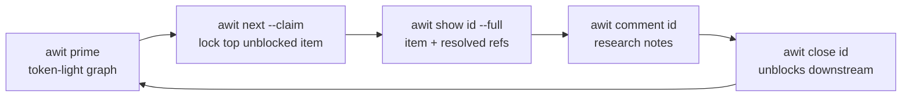
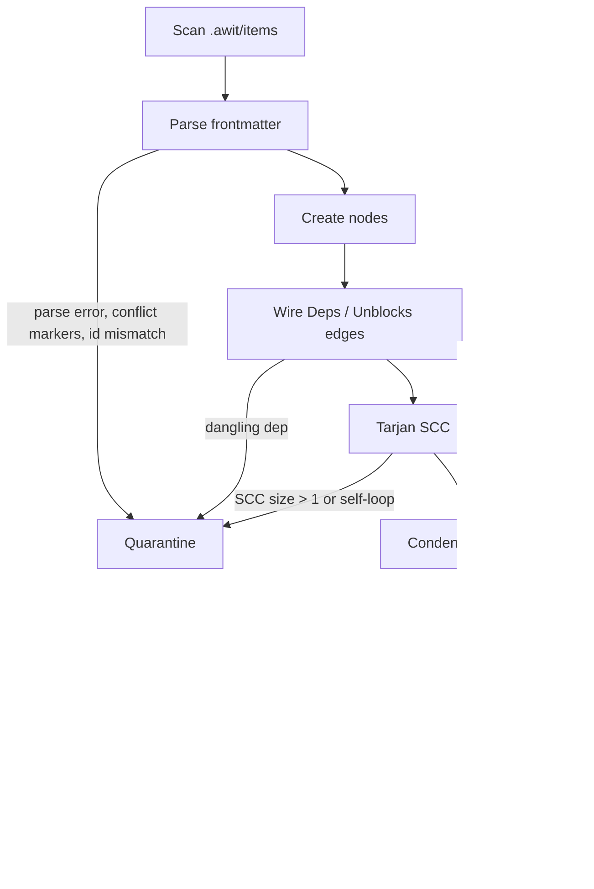

# How awit works

Files are the state; each command is one process; Git is the sync protocol.
This page is the conceptual tour. Signatures, flags and conventions live in
the [Design Spec](design-spec.md); bytes on disk live in the
[On-disk Schema](schema.md).

## The store

One item is one file: `.awit/items/<id>.md`, YAML frontmatter plus a Markdown
body, filename stem equal to the `id` key. Comments and `--file` attachments
live under `.awit/comments/<id>/` and are appended to the item's `refs`.
Refs are repo-root relative with forward slashes.

→ [the schema](schema.md)

## The loop

Each step is one process invocation; state between steps lives only in the
files and in Git. `--claim` writes `status: in_progress`, `assignee`,
`claimed_at`, then commits `awit: claim <id>` touching only that file — the
commit turns a double-claim across worktrees into a merge conflict instead
of silent duplication.

→ [Design Spec: Agent surface](design-spec.md#agent-surface)

## The graph

Every command rebuilds this graph from scratch — O(V+E); hundreds of items
resolve in well under 10 ms. `status` (`open`/`in_progress`/`closed`) is
stored; ready/blocked eligibility is derived: ready means not closed, no
manual hold, every dep closed. A stored `blocked_reason` holds an item
regardless of deps.

→ [Design Spec: Graph engine](design-spec.md#graph-engine)

## Ranking: what to do next

Each ready item scores its transitive unblock count — unique non-closed
downstream nodes. `prime` sorts by unblocks desc, ID asc (deterministic,
prompt-cacheable); `next` ranks the same way but breaks ties randomly so two
agents racing a claim diverge. The critical path is the longest path over
open nodes. Priority is a label, never a field: `awit next -l p0` is the
priority check.

→ [Design Spec: `awit next`](design-spec.md#awit-next)

## When files go wrong: quarantine

Cycles, dangling deps, unparseable frontmatter, Git conflict markers, ID
mismatches and duplicate IDs all become quarantine through one path.
Quarantined items are excluded from `next`, listed under `GRAPH WARNINGS` in
`prime`, and reported as `FAIL` by `validate` — each with the `fix:` command
that repairs it. The CLI never panics on a bad file. `validate` is the
intended pre-commit hook.

→ [Design Spec: Decisions](design-spec.md#decisions)

## Holding work: blocks vs labels

A `blocked_reason` holds; the `blocked` label does not — `create`, `update`
and `import` print one stderr warning when a hold-less non-closed item newly
receives that exact label. `awit block <id> --reason "<obstacle and release
condition>"` stores the hold (open + claim cleared, one save); `awit
unblock` removes only it; `release` preserves it, `close` clears it.

→ [Design Spec: Decisions](design-spec.md#decisions)

## External trackers

Local state pushes one way to a linked Gitea (`tea`) or GitLab (`glab`)
issue: `close` pushes closed, `release` pushes open, explicit `update
--status` pushes the mapped state. `import` is a one-time snapshot (number,
exact body, labels, open/closed); labels are copied once and never synced.
Local state is canonical: a failed push keeps the local mutation, prints one
stderr retry warning, and still exits 0.

→ [Setup & Usage: External trackers](usage.md#external-trackers)

## Keeping items/ small: archive

`awit archive` moves finished work out of the hot path: the archive set is
the fixed point of closed, non-quarantined items with no dependant outside
the set (anything else would become a `DANGLING DEP` fault on departure).
Comments collapse into the archived file; `--file` attachments move beside
it. There is no `unarchive`; `git revert` is the way back.

→ [Design Spec: Archive](design-spec.md#archive)
