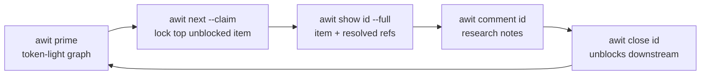
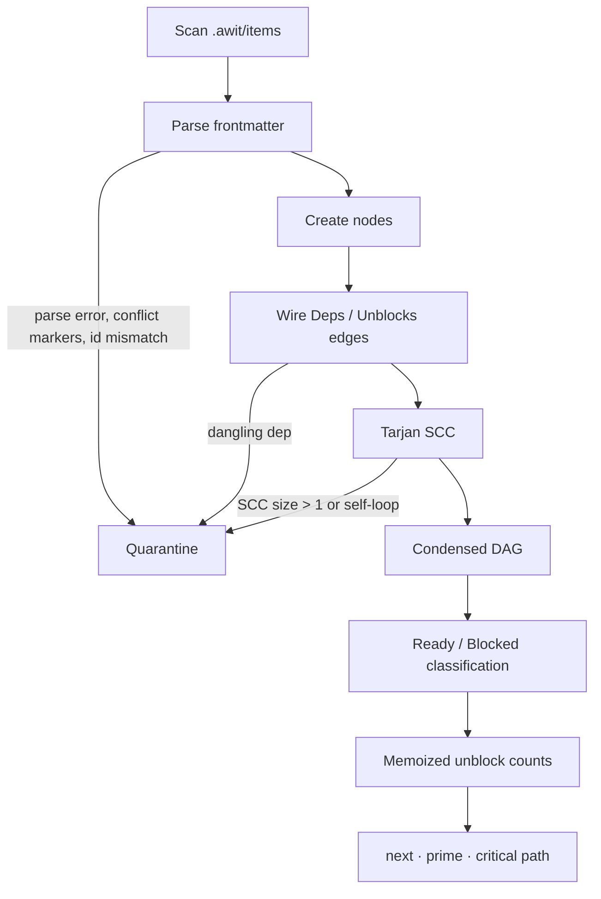

# awit — Implementation Plan

2026-09-17 · @Jan

## Overview

awit is a zero-daemon Go CLI that turns Markdown files under `.awit/` into a dependency graph that humans and agents work from — offline, versioned in Git, no database. Every command rebuilds the graph from `.awit/items/*.md`, so a clone is the whole state and there is nothing to migrate or repair besides text files.

The loop it serves:



Each step is one process invocation; state between steps lives only in the files and in Git.

Non-goals for v1: no sync to GitLab or GitHub issues, no web UI, no cross-repo graphs, no coordination beyond a single checkout except through Git itself.

## Decisions

Seven decisions from the review are locked. The `priority` field is gone, IDs are time-sortable, and every graph fault goes through one quarantine path.

| Decision | Choice | Why |
| --- | --- | --- |
| ID scheme | Snowflake-like, 40 bits, `PREFIX-` + 8 Crockford base32 chars, fixed width | Sequential IDs collide across parallel worktrees; fixed-width base32 sorts chronologically in `ls` |
| Priority | No frontmatter field; priority is a label by convention (`p0`, `p1`, …) | Keeps ranking to one axis; agents ask for priority via `-l` |
| Ranking in `next` | Transitive unblock count desc, ties random; `-l` filters the ready set first | Random ties make two agents racing `next` diverge instead of double-claiming |
| Ranking in `prime` | Unblocks desc, then ID asc — deterministic | Identical state must yield identical bytes for prompt caching and tests |
| Frontmatter writes | `yaml.v3` Node editing; only changed scalars rewritten | `awit update` produces a one-line git diff; unknown keys, order and body stay intact |
| Comment filenames | `<UTC seconds>-<author>.md`, e.g. `20260917T143205Z-claude.md`; `-2` suffix on collision | Per-day sequence numbers collide across branches |
| Claims | Soft claim: writes `status`, `assignee`, `claimed_at`, then commits (`awit: claim <id>`) unless the commit policy says no — `--commit=false`, a true `--no-commit`, or `commit: false` in `config.yaml` | A claim is invisible to other worktrees until pushed; committing makes the double-claim a merge conflict, which quarantine surfaces. Repositories whose orchestrator owns commits opt out once in config instead of per command |

### ID layout

| Field | Bits | Source |
| --- | --- | --- |
| Timestamp | 30 | Seconds since 2026-01-01T00:00Z (~34 years) |
| Worker | 6 | FNV-1a of hostname + worktree path + branch name, mod 64; `AWIT_WORKER` env overrides |
| Random | 4 | `crypto/rand`; re-roll if the file already exists |

Worker hashes the branch name as proposed, plus hostname and worktree path so two clones both on `main` do not share a worker. A per-process sequence counter is meaningless for a one-shot CLI, so the low bits are random and a local collision re-rolls; duplicate IDs across branches are a `validate` check. `create --id` overrides for imports.

### Quarantine

One mechanism covers cycles, dangling deps, unparseable frontmatter, Git conflict markers, and duplicate IDs. Quarantined items are excluded from `next`, listed under `=== GRAPH WARNINGS ===` in `prime`, reported as `FAIL` by `validate`, and still visible in `list` and `show` with a flag. The CLI never panics on a bad file. Any command that reads the graph (`list`, `next`, `prime`, `show`, `validate`, `dep`, `archive`) prints one stderr line first — `warning: N items quarantined, run awit validate` — when its initial load holds quarantined items or broken files (N = quarantined nodes plus broken files, same wording for N=1); stdout, exit codes and goldens are untouched, and `label`, which builds no graph, stays silent.

### Paths and platforms

`refs` are stored with forward slashes (`filepath.ToSlash` on write, `FromSlash` on read). Files are written temp-then-rename. CI runs on Linux and Windows from the first commit; `init` gitignores only `.awit/.lock`. It may also write agent skill files outside `.awit/` (see `awit init --skills`); those are project config and are committed, never gitignored.

## Data model

Everything is a Markdown file under `.awit/`; the only non-committed file is the lock.

```text
.awit/
├── config.yaml                        # prefix, default_labels, labels, stale_claim, template
├── items/
│   ├── AWIT-0K7M2QX9.md               # one lean item per file, ID = filename
│   └── AWIT-0K7M3A1F.md
├── comments/
│   └── AWIT-0K7M2QX9/
│       ├── 20260917T143205Z-claude.md
│       └── 20260917T151047Z-jan.md
└── archive/                           # written only by `awit archive`
    ├── AWIT-0K7LZ9RT.md               # item + comments collapsed into one file
    └── AWIT-0K7LZ9RT/                 # only when the item had --file attachments
        └── 20260916T090000Z-jan.log
```

Revised item schema:

```markdown
---
id: AWIT-0K7M2QX9
title: Implement OAuth2 bearer token extraction
brief: >-
  The API gateway rejects valid bearer tokens that contain URL-safe base64
  characters. Fix header parsing in the auth middleware and return a
  structured 401 on invalid signatures.
status: in_progress            # open | in_progress | closed
deps: [AWIT-0K7LZ9RT]          # blocked by these IDs
labels: [auth, api, p1]        # priority is a label by convention
assignee: agent/claude
claimed_at: 2026-09-17T14:32:05Z
refs_base: repo
refs:
  - .awit/comments/AWIT-0K7M2QX9/20260917T143205Z-claude.md
  - docs/architecture/auth-middleware-spec.md
---

## Summary
...

## Acceptance Criteria
- ...
```

| Field | Type | Rules |
| --- | --- | --- |
| `id` | string | Must equal the filename stem; mismatch → quarantine |
| `brief` | string | One to three sentences of prose summarizing the item. `create` requires `--brief`; `import` derives it from the remote title (else the body's first sentence, capped at 240 code points) unless given explicitly. `validate` warns when it is missing or runs past three sentences — an item that cannot be briefed that tightly should be split |
| `status` | enum | `open`, `in_progress`, `closed`; blocked is derived, never stored |
| `deps` | list | Unknown ID → item is blocked and quarantined (dangling dep) |
| `labels` | list | Free-form; `p0`–`p4` recommended for priority. Optional `config.yaml` `labels` is advisory |
| `assignee` | string | `human/<name>` or `agent/<id>`; set by `--claim` or `--assign` |
| `claimed_at` | RFC 3339 | Set by `--claim`, cleared by `release` and `close`; drives stale-claim check |
| `refs` | list | Paths relative to the repo root when `refs_base: repo` (default for new writes), forward slashes only. Omitted `refs_base` means historical `.awit/items/`-relative refs, rewritten on first mutation. `ref add` refuses a missing target (exit 1, no write) unless `--allow-missing` plans it ahead; nothing else checks existence and `show --full` keeps its `[missing]` report |
| `external` | mapping | Optional Gitea or GitLab link `{tracker, repo, id, url}`. `tracker` is `gitea` or `gitlab`. `id` is the Gitea issue number or GitLab iid. GitLab `repo` allows subgroups. Invalid or legacy scalar values warn on `validate` and do not quarantine |
| `alias` | string | Optional human alias, `[A-Za-z][A-Za-z0-9._-]{0,127}`, never ID-shaped; case-insensitively unique across active items (warned, not enforced); lookup-only, never a filename or dep edge |

Unknown keys are preserved on write so teams can add their own fields without a schema change. `config.yaml` holds `prefix`, optional `default_labels`, optional `labels` (advisory vocabulary; missing/empty disables; `create`/`update` warn on unknown names they introduce but still store them), `stale_claim` (duration, default `2h`), `agent_id` (overridden by `AWIT_AGENT`), and optional `template` (repo-root-relative forward-slash path to a body-only file `create` copies verbatim; absent keeps the default skeleton; `import` ignores it).

### Archive

`items/` grows forever otherwise, and every command re-parses all of it. `awit archive` moves finished work out of the hot path without touching the graph engine: an archived item simply no longer exists as far as `Build` is concerned.

That is also the constraint. A closed item `Y` that any remaining item still lists in `deps` would become a `DANGLING DEP` fault on that dependant the moment `Y` leaves `items/`. So the archive set is the **fixed point**: start with every closed, non-quarantined item; repeatedly drop any item that has a dependant outside the set; stop when nothing changes. Items that stay behind are still closed and still satisfy their dependants; they get archived on a later run once their dependants are archivable too. No index file, no "external closed" state in the graph, no rewriting of other items' `deps`.

Per archived item: the file is rewritten to `archive/<id>.md` with its comments appended as a `## Comments` section in chronological order (comment `refs` removed from frontmatter, everything else preserved), `--file` attachments move to `archive/<id>/` with their `refs` rewritten to `.awit/archive/<id>/<file>`, then `items/<id>.md` and `comments/<id>/` are deleted. Archived items are invisible to every other command; the history lives in Git and in the archive file. There is no `unarchive`; `git revert` is the way back.

## Graph engine

The graph is rebuilt on every command, and every operation runs on the condensed DAG left after quarantine. Build is O(V+E); hundreds of items resolve in well under 10 ms.



### Operations

| Operation | Algorithm | Notes |
| --- | --- | --- |
| Cycle pre-check on `dep add A B` (A depends on B) | DFS from **B** over `Deps`, looking for **A** | The draft sketch searched from A for B, which detects a redundant edge, not a cycle. Record the path for the error message |
| Cycle detection on load | Tarjan SCC | One report per SCC; the DFS back-edge path is used only to print one example chain |
| Ready / Blocked | Inspect `Deps` | Ready: not closed and every dep closed. Blocked: not closed and any dep open, dangling, or quarantined |
| Unblock score | BFS over `Unblocks`, count unique non-closed nodes | Computed once per build and cached on the node; never inside a sort comparator |
| Critical path | Longest-path DP in topological order | Over non-closed, non-quarantined nodes only; ties broken by ID |

### Error contract

`dep add` refuses before any write:

```text
Error: cannot add dependency AWIT-0K7LZ9RT to AWIT-0K7M2QX9.
Cycle: AWIT-0K7M2QX9 -> AWIT-0K7LZ9RT -> AWIT-0K7M1B4C -> AWIT-0K7M2QX9
```

`validate` reports every quarantine reason with the command that fixes it, exits non-zero on any `FAIL`, and is the intended pre-commit hook.

## CLI command matrix

Seventeen commands; `-p` is gone everywhere, `release`, `validate`, `label`, `archive`, `import`, `ref` and `external` are new, and every list-shaped output honours `--format compact|table|json` (compact when stdout is not a TTY).

| Command | Flags | User | Purpose |
| --- | --- | --- | --- |
| `awit init` | `--prefix`, `--skills`, `--no-skills`, `--force` | Human | Create `.awit/`, `config.yaml`, gitignore `.awit/.lock`; offer to seed the driving-awit skill |
| `awit create <title>` | `--brief`, `-d deps`, `-l labels`, `--assign`, `--alias`, `--id`, `--external-tracker`, `--external-repo`, `--external-id`, `--external-url` | Both | Mint a snowflake ID, write a lean item; optional Gitea or GitLab mapping |
| `awit import <issue-url>` | `[--brief]`, `--alias`, `--tea-login` | Both | One-time snapshot of a Gitea (`tea`) or GitLab (`glab`) issue; keeps number/iid, exact body, labels, open/closed state; refuses tracker-aware duplicates (active or archived). Omitted `--brief` derives from the remote title (else the body's first sentence, capped at 240 code points); blank title plus empty body exits 1. `--tea-login` is Gitea-only |
| `awit external check [key]` | `--tea-login` | Both | Read-only byte-exact body comparison for linked Gitea (`tea`) or GitLab (`glab`) items; `MATCH`/`DRIFT`/`ERROR` rows plus totals; exit 1 on drift/error. `--tea-login` is Gitea-only |
| `awit external push-body <key>` | `--tea-login` | Both | Explicit local-canonical repair: pushes body bytes (Gitea via `tea`, GitLab via `glab`), refuses ambiguous links and GitLab quick-action bodies, verifies the remote bytes |
| `awit list [key]` | `-s status`, `-l label`, `--ready`, `--blocked`, `--quarantined`, `--format` | Both | Index view; `[key]` selects exactly one item |
| `awit label` | `--state open\|closed\|all`, `--format` | Both | Label vocabulary with usage counts; answers "what labels exist and how busy are they" |
| `awit show <id>` | `--full`, `--refs-only` | Agent | Core item (~200 tokens) or full resolved ref tree |
| `awit comment <id> [text]` | `--file <path>`, `--author` | Both | Write a timestamped comment or attach an external file; append to `refs` |
| `awit update <id>` | `--status`, `--brief`, `--assign`, `--label`, `--unlabel`, `--title`, `--alias`, `--clear-alias`, `--external-tracker`, `--external-repo`, `--external-id`, `--external-url`, `--clear-external`, `--push=true\|false`, `--no-push`, `--tea-login` | Both | Mutate frontmatter with a minimal diff; an explicit `--status` also pushes the mapped state (`closed`→closed, `open`/`in_progress`→open) to the linked Gitea or GitLab issue unless `external_push: false` or `--push=false`/`--no-push`; local-first with a stderr retry warning on remote failure |
| `awit close <id>` | `--reason`, `--author`, `--push=true\|false`, `--no-push`, `--tea-login` | Both | Set `closed`, clear `claimed_at`, append reason as a comment; pushes `closed` to the linked Gitea or GitLab issue unless `external_push: false` or `--push=false`/`--no-push` |
| `awit release <id>` | `--push=true\|false`, `--no-push`, `--tea-login` | Both | Reopen an in-progress or closed item to `open`, clear `assignee` and `claimed_at`; prints `reopened <id>` (plain line, ignores `--format`); pushes `open` to the linked Gitea or GitLab issue unless `external_push: false` or `--push=false`/`--no-push` |
| `awit dep add\|rm <id> <dep>` | — | Both | Edit `deps` with cycle pre-check |
| `awit ref add\|rm <id> <path>` | `add --allow-missing` | Both | Add or remove a repo-root-relative file reference; `add` refuses a missing target (exit 1, no write) unless `--allow-missing` plans it ahead; does not copy, delete, or commit |
| `awit validate` | `--stale-claims` | Both | Integrity report; non-zero exit on `FAIL`; invalid `external` is a WARN |
| `awit archive` | `--dry-run` | Human | Move the fixed-point set of closed items to `.awit/archive/`, one collapsed file each |
| `awit prime` | `--max-tokens`, `-l label` | Agent | Deterministic state graph for prompt injection |
| `awit next` | `-l label`, `--claim`, `--commit=true\|false`, `--no-commit` (deprecated), `--seed`, `--why` | Agent | Top unblocked item; optional claim; `--why` explains the pick on stderr |

Global flags: `--format`, `--repo <path>` (locate `.awit/` explicitly instead of walking up), `--no-color`.

Every `<id>` argument (and `dep`/`create -d` values) accepts a canonical ID (exact, wins), an alias (case-insensitive), or an external key `owner/repo#<n>` / `group/sub/project#<n>` / unique bare `#<n>`; ambiguity (including the same repo and number on two trackers or hosts) is an error naming the canonical IDs.

## Agent surface

`prime` is a deterministic snapshot; `next` is a possibly-random pick. Both show labels and unblock counts and nothing about priority beyond what the labels say.

### `awit prime`

```text
=== GRAPH WARNINGS ===
[CYCLE] AWIT-0K7M0A1B -> AWIT-0K7M0C2D -> AWIT-0K7M0A1B (excluded from next)
[DANGLING DEP] AWIT-0K7M0E3F depends on unknown AWIT-0K7M9ZZZ

=== READY (3) ===
[AWIT-0K7M2QX9] Implement OAuth2 token extraction | auth,api,p1 | Unblocks: 4
[AWIT-0K7M3A1F] Update database migration scripts | db | Unblocks: 1
[AWIT-0K7M3B2G] Fix flaky CI job | ci,p2 | Unblocks: 0

=== BLOCKED (2) ===
[AWIT-0K7M4C3H] Add E2E auth tests <- AWIT-0K7M2QX9
[AWIT-0K7M4D4J] Rotate tokens <- AWIT-0K7M2QX9, AWIT-0K7M4C3H

=== CRITICAL PATH (3) ===
AWIT-0K7M2QX9 -> AWIT-0K7M4C3H -> AWIT-0K7M5E5K
```

Rules:

- Ready sorted by unblocks desc, then ID asc; blocked sorted by ID. No timestamps, no randomness, so identical state yields identical bytes.
- Warnings section is omitted when empty; counts in headers let the agent see truncation.
- `--max-tokens N` budgets at ~4 chars per token (soft budget with a mandatory floor): shed BLOCKED rows from the end, then READY rows from the end (never the first), then the critical-path section as a whole, then scaffolding (empty sections, the `(+N more)` notice, READY/BLOCKED headers, finally the warnings heading). Kept rows are prefixes; counts stay post-filter/pre-truncation. Warning detail lines and the top READY row are never shed — when even they exceed N, `prime` emits them anyway. Negative budgets are usage errors (exit 2).
- `-l label` restricts ready and blocked to items carrying that label (repeatable).

### `awit next`

Output is one compact line, or JSON with `--format json`:

```text
[AWIT-0K7M2QX9] Implement OAuth2 token extraction | auth,api,p1 | Unblocks: 4
```

- Candidate set = ready items minus quarantined, filtered by `-l`; ranked by unblocks desc; ties broken by `math/rand` seeded from time, or from `--seed` in tests.
- Empty candidate set exits 1 with `No ready items` (and the active label filter) so a loop can stop cleanly.
- `--claim` sets `status: in_progress`, `assignee: agent/<id>`, `claimed_at: now`, writes the file, and commits `awit: claim <id>` touching only that file. The commit follows the policy: explicit `--commit=true|false` or a true `--no-commit` (deprecated) beats `config.yaml commit:` which beats the default `true`; `--no-commit=false` is neutral; passing both `--commit` and a true `--no-commit`, or a non-bool `--commit` value, is usage error 2 before any write. Without `--claim` the policy flags write and commit nothing.
- Agent identity: `--agent`, else `AWIT_AGENT`, else `config.agent_id`; none → refuse `--claim`.
- `--why` prints one stderr line after a successful pick or claim, stdout byte-identical: `why: <id>; unblocks=<N>; critical-path=<yes|no>; selection=<max-unblocks|explicit>; tie-break=<none|pcg(seed=<S>,candidates=<K>)>`. `K` is the equal-maximum group after label filtering (`K=1` → `none`); the printed seed replays the tie-break. Exact lookups report `selection=explicit`. No line on failed selection, refused claim, or empty candidates.

The intended priority check is `awit next -l p0` without `--claim`: it answers whether anything critical is ready and how much it unblocks, and the agent decides from there.

## Phased plan

Six phases; phases 1–2 set the codebase's shape, and the agent surface waits until `validate` is trustworthy.

| Phase | Scope | Exit criterion |
| --- | --- | --- |
| 0 | Skeleton, config, ID minting | `awit init` and `awit --version` pass on Linux and Windows CI |
| 1 | Item store, human CLI, formatters | Round-trip test byte-identical; `update --status` diff is one line |
| 2 | Graph core, `dep`, `validate` | Fixture repos produce exactly the expected `PASS`/`FAIL` lines |
| 3 | `prime`, `next`, critical path | Two `prime` runs on identical state produce identical bytes |
| 4 | Comments, resolver, `show --full` | Agent loop runs end to end against a fixture |
| 5 | Locking, stale claims, hooks, release | Tagged binaries for linux/windows/darwin via goreleaser |

### Phase 0 — skeleton

- [ ] `go mod init`, layout as drafted: `cmd/awit`, `pkg/{item,graph,resolver,format,id}`
- [ ] `urfave/cli` v3 root command, `--format`, `--repo`, `--no-color`; TTY detection for the default format
- [ ] `pkg/id`: base32 encode/decode, worker hash, minting; property test that IDs sort by creation time
- [ ] `config.yaml` load with defaults; `AWIT_AGENT` / `AWIT_WORKER` env handling
- [ ] GitHub/GitLab CI matrix: linux + windows, `go vet`, `staticcheck`, tests

### Phase 1 — item store and human CLI

- [ ] `pkg/item`: frontmatter split, `yaml.v3` Node parse, targeted scalar rewrite, body kept as raw bytes
- [ ] Round-trip test: parse → write must be byte-identical on every fixture; fuzz the splitter
- [ ] `store.go`: scan, load all, atomic write (temp + rename), filename/ID consistency check
- [ ] Commands: `init`, `create` (optional `config.template` body file), `list`, `show` (default view), `update`, `close`, `release`
- [ ] Formatters `compact`, `table`, `json` with golden files and an `-update` flag

### Phase 2 — graph core

- [ ] `Build` with dangling-dep detection and parse-error carry-through
- [ ] Tarjan SCC → quarantine set; example chain via DFS back edge
- [ ] Ready/blocked classification; memoized transitive unblock counts
- [ ] `dep add` with corrected pre-check (DFS from the new dependency toward the dependant); `dep rm`
- [ ] `validate` with all quarantine reasons, fix-it hints, non-zero exit
- [ ] `testdata/` fixtures: clean, cyclic, dangling, conflicted, duplicate-id, id-mismatch

### Phase 3 — agent surface

- [ ] Ranking: unblocks desc, ID tie-break for `prime`, seeded random tie-break for `next`
- [ ] `-l` filtering on both commands
- [ ] Critical path via longest-path DP on the condensed DAG
- [ ] `prime` renderer with section ordering, counts, `--max-tokens` truncation
- [ ] `next --claim`: frontmatter write, `claimed_at`, git commit via `os/exec`, `--no-commit`
- [ ] Determinism test: identical fixture → identical `prime` bytes across two runs and two OSes

### Phase 4 — progressive disclosure

- [ ] `comment` inline and `--file`; timestamped filenames with collision suffix; `refs` append (`.awit/comments/<id>/…`)
- [ ] `pkg/resolver`: relative-path resolution from a caller-chosen base directory (repo root or `.awit/items/`), slash normalisation, missing-file reporting
- [ ] `show --full` with delimiter headers per ref; `--refs-only`; cycle-safe if a ref points at another item; `ref add`/`rm`
- [ ] End-to-end test running the five-step loop against a fixture repo
- [ ] `ref add` existence check: stat the resolved target before any mutation, `--allow-missing` escape hatch for planned documents

### Phase 5 — hardening

- [ ] Optional `.awit/.lock` (flock / LockFileEx) for same-checkout concurrency
- [ ] `validate --stale-claims` using `config.stale_claim`
- [ ] Documented pre-commit hook running `awit validate`
- [ ] goreleaser config, version embedding, `README` with the agent loop
- [ ] `init --skills`: detect `.claude`, `.omp`, `.opencode`, `.agents`, `.pi` and offer to seed the driving-awit skill from an embedded asset
- [ ] Structured `external:` Gitea or GitLab mapping (`tracker`, `repo`, issue `id`/`iid`, `url`); invalid values warn, do not quarantine
- [ ] GitLab remote access through the concrete `internal/glabx` wrapper only (pre-authenticated `glab` 1.118.0 subprocess: verified byte-exact description writes, `state_event` close/reopen, column-zero quick-action refusal). No shared transport/provider framework, no login management, no MRs, no body rewriting. `awit import` accepts GitLab issue and work_items URLs; `external check` / `push-body` route by tracker to tea or glab
- [ ] `archive`: fixed-point eligibility, comment collapse, attachment move, `--dry-run`; `validate` stays `PASS` afterwards

## Open questions

Six items still need a call before their phase starts; none block phase 0.

- [ ] Multiple `-l` flags on `next`/`prime`: AND (all labels) or OR (any label)? Leaning AND, with `-l p0,p1` as comma-OR inside one flag.
- [ ] Worker hash input: branch only, as proposed, or hostname + worktree path + branch as written above?
- [ ] Should `close` commit like `--claim` does, or stay a plain file write?
- [ ] Comment author source: `AWIT_AGENT` for agents, `git config user.name` for humans, or always explicit `--author`?
- [ ] Token estimate for `--max-tokens`: chars/4 is cheap and wrong by ±20%; is that acceptable, or embed a tokenizer?
- [ ] Timestamp epoch `2026-01-01` and 30 bits gives ~34 years; widen to 32 bits (10 chars) or accept?
