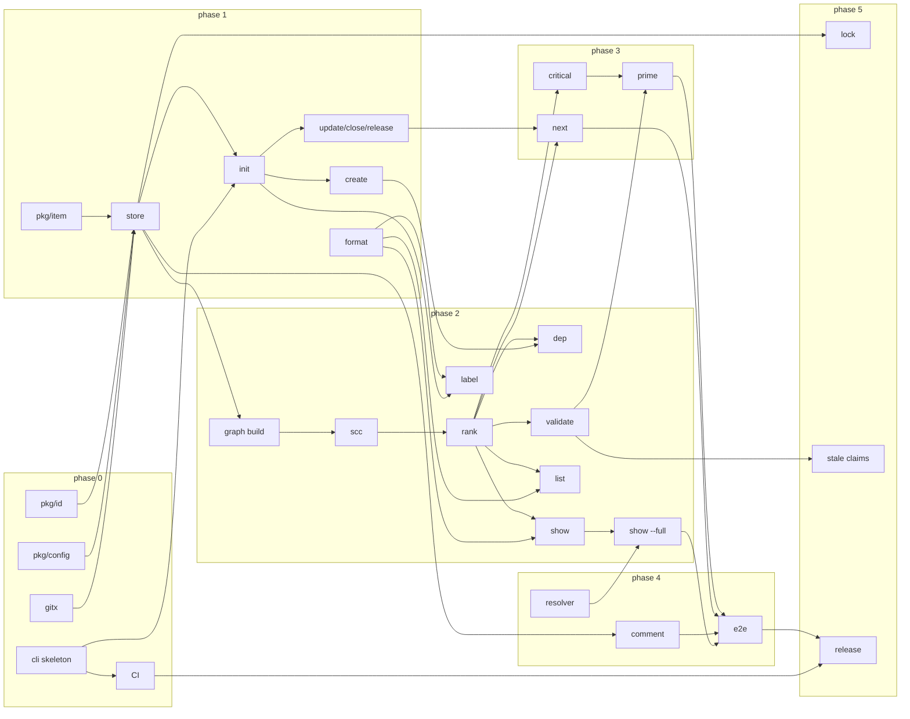

# awit — Implementation Guide

> **For agentic workers:** REQUIRED SUB-SKILL: Use superpowers:subagent-driven-development (recommended) or superpowers:executing-plans to implement this plan one work item at a time. Work items live in `.awit/items/` and use checkbox (`- [ ]`) steps.

**Goal:** Build `awit`, a zero-daemon Go CLI that turns Markdown files under `.awit/` into a dependency graph for humans and agents.

**Architecture:** Every command rebuilds an in-memory graph from `.awit/items/*.md`, operates on it, and writes back at most one file with a minimal diff. No database, no daemon, no state outside the files and Git. Faults (parse errors, cycles, dangling deps, conflict markers, id mismatches, duplicate ids) all flow through one quarantine path.

**Tech Stack:** Go 1.27, `github.com/urfave/cli/v3` (CLI), `gopkg.in/yaml.v3` (frontmatter, Node-level editing), stdlib only otherwise. `git` is invoked via `os/exec`, never linked.

**Spec:** [`plan/awit-implementation-plan.md`](awit-implementation-plan.md). This guide implements that spec; where the two disagree, this guide wins because it resolves the spec's open questions.

**Work items:** `.awit/items/AWIT-*.md` — this repo dogfoods its own format. Index and dependency order in [§9](#9-work-item-index).

---

## 1. Global constraints

Every work item inherits these. Copy them into your head before you start.

- Module path: `github.com/eisenwinter/awit`. Binary: `cmd/awit`. Go `1.27.1` as in `go.mod`.
- Dependencies allowed: `github.com/urfave/cli/v3`, `gopkg.in/yaml.v3`. Nothing else without a work item saying so. (`golang.org/x/sys` is allowed only in `pkg/lock` for Windows `LockFileEx`.)
- Must compile and pass `go vet`, `staticcheck`, and `go test ./...` on **Linux and Windows**. Never hardcode `/` in filesystem paths; use `filepath`. `refs` inside frontmatter are always forward slashes (`filepath.ToSlash` on write, `filepath.FromSlash` on read).
- Every file write is temp-then-rename in the same directory (`os.CreateTemp(dir, ".tmp-*")`, write, `Close`, `os.Rename`). No exceptions.
- The CLI **never panics on a bad file**. Any file that cannot be parsed becomes a quarantine fault and the command continues.
- Output that is compared in tests (`prime`, `compact`, `validate`) is **deterministic**: no timestamps, no map iteration order, no randomness unless the command is explicitly random (`next` tie-break only).
- Errors go to stderr, prefixed `Error: `. Exit codes: `0` success, `1` expected non-success (`next` with no candidates, `validate` with FAIL, cycle refused), `2` usage error (urfave default).
- No colour anywhere in v1 output; `--no-color` is accepted and is a no-op that exists so scripts written today keep working.
- Commit after every green step. Commit message format: `<scope>: <imperative summary>` where scope is the package or command (`id: add base32 codec`, `cli/next: seeded tie-break`).
- Tests: `testing` stdlib only, table-driven, `t.TempDir()` for filesystem. Golden files under `testdata/golden/` with an `-update` flag (`var update = flag.Bool("update", false, "rewrite golden files")`). Fixtures under `testdata/fixtures/<name>/.awit/…`.
- Do not run formatters/linters project-wide inside a work item beyond `gofmt` on files you touched; CI runs `go vet` and `staticcheck` once.

## 2. Resolved decisions

The spec left six questions open. They are decided here so that no work item has to guess. Change them only by editing this section first.

| # | Question | Decision |
| --- | --- | --- |
| 1 | Multiple `-l` flags on `next`/`prime`/`list` | **AND across flags, OR within a flag.** `-l p0 -l auth` = items with `p0` **and** `auth`. `-l p0,p1` = items with `p0` **or** `p1`. Parsed into `[][]string` by `cli.SplitLabels`. |
| 2 | Worker hash input | **hostname + worktree absolute path + branch name**, FNV-1a 32-bit, `% 64`. `AWIT_WORKER` (0–63) overrides. Branch missing (not a git repo) → empty string, still hashed. |
| 3 | Does `close` commit? | **No.** Only `next --claim` commits. `close` is a plain file write; the human or agent commits when they are done. |
| 4 | Comment author source | `--author` flag → `AWIT_AGENT` env → `config.agent_id` → `git config user.name` (spaces replaced by `-`, lowercased) → error `Error: no author; pass --author or set AWIT_AGENT`. Agents get `agent/<name>` prefix only when the value came from `AWIT_AGENT`/`agent_id`; `--author` and git name are used verbatim. |
| 5 | Token estimate for `--max-tokens` | **`len(bytes)/4`**, integer division. Documented as approximate. No tokenizer dependency. |
| 6 | ID epoch and width | **Keep**: epoch `2026-01-01T00:00:00Z`, 30-bit seconds, 6-bit worker, 4-bit random, 8 Crockford chars. Rolls over in 2060. `Encode` returns an error if timestamp exceeds 30 bits. |

Additional decisions made while writing work items:

| Topic | Decision |
| --- | --- |
| CLI package layout | Commands live in `internal/cli/`, one file per command. `cmd/awit/main.go` is three lines. |
| Item body template on `create` | `\n## Summary\n\n## Acceptance Criteria\n\n` (leading newline separates from closing `---`). |
| Frontmatter key order for new items | `id, title, brief, status, deps, labels, assignee, claimed_at, refs`. Keys with empty values (`assignee`, `claimed_at`) are **omitted** on create and **deleted** from the mapping when cleared. `deps`, `labels`, `refs` are always present, `[]` when empty. |
| Sequence style | `deps` and `labels` are written flow style `[a, b]`. `refs` is written block style (one `- path` per line) because paths are long. When editing an existing item, the existing node's style is preserved. |
| `brief` style | Written as `>-` folded scalar (`yaml.FoldedStyle`) when it contains a newline or is longer than 80 chars, plain otherwise. |
| `claimed_at` format | `time.RFC3339` in UTC, seconds precision. |
| Comment file format | Frontmatter `author`, `created` (RFC3339 UTC) then blank line then the text. Attached files (`--file`) are copied verbatim, no frontmatter. |
| `awit label` semantics | `--state open` (default) counts items whose status is **not** `closed` (so `open` + `in_progress`); `--state closed` counts only closed; `--state all` counts every parseable item. Quarantined items are counted (they still carry labels); unparseable files are not. Rows sorted by count desc, then label asc. Labels never declared anywhere — the vocabulary is whatever items use. |
| Comment filename | `<YYYYMMDDTHHMMSSZ>-<author>.md`; author sanitised to `[a-z0-9._-]` (others → `-`, `agent/` prefix stripped). Collision → `-2`, `-3`, … before `.md`. `--file` keeps the original extension. |
| Duplicate ID definition | Two files in `items/` whose stems are equal case-insensitively (`strings.EqualFold`). Both are quarantined `DUPLICATE ID`. |
| `next` tie-break | `math/rand/v2` with `rand.NewPCG(seed, seed)`; seed from `--seed` if set else `time.Now().UnixNano()`. Shuffle only within equal-unblock groups. |
| Unblock count | Number of **unique, non-closed, non-quarantined** nodes reachable via `Unblocks` edges (transitive). Quarantined nodes have `UnblockCount == -1`. |
| Critical path | Longest path (by node count) over non-closed, non-quarantined nodes following `Unblocks` edges in topological order; ties by smaller ID at each DP step. Printed from the root (item with no open deps) downstream. |
| `--repo` semantics | Path to the directory that **contains** `.awit/`. Without it, walk up from cwd until a directory containing `.awit/` is found; stop at filesystem root with `Error: no .awit directory found (run awit init)`. |
| Git commit on `--claim` | `git -C <root> add <itemfile>` then `git -C <root> commit -m "awit: claim <id>" -- <itemfile>`. Commit failure is an error **after** the file was written; message tells the user the file is claimed but uncommitted. |
| Archive eligibility | Fixed point over the graph: start with every closed, non-quarantined node; repeatedly remove any node with an `Unblocks` neighbour outside the set (open, quarantined, or closed-but-not-in-set); stop when stable. Result sorted by ID. Never rewrites another item's `deps`, never introduces an index file; the graph engine is unchanged. |
| Archive layout | Flat `.awit/archive/<id>.md`, same depth as `items/`, so non-comment `refs` (`../../plan/x.md`) stay valid without rewriting. `--file` attachments move to `.awit/archive/<id>/<file>`; their ref becomes `../archive/<id>/<file>` (still items-relative — the ref convention does not change for archived files). |
| Comment collapse format | Original item bytes, then `\n## Comments\n` and one `\n### <created RFC3339 UTC> <author>\n\n<text>\n` block per comment, ordered by comment filename asc (chronological). Comment refs (`../comments/<id>/…` with frontmatter `author`+`created`) are removed from `refs`; all other frontmatter untouched (node edit, unknown keys kept). No `archived_at` key — Git records when. Items with zero comments get no `## Comments` section. |
| Comment vs attachment | A file under `comments/<id>/` is a **comment** when `Split` succeeds and the frontmatter has `author` and `created`; every other file is an **attachment** (verbatim `--file` copy) and is moved, never inlined. No MIME sniffing. |
| Archive write order | Per item: write `archive/<id>.md` atomically → move attachments (`os.Rename`, atomic write fallback on cross-device) → `os.Remove(items/<id>.md)` → `os.RemoveAll(comments/<id>)`. Idempotent: if both `archive/<id>.md` and `items/<id>.md` exist (crash between steps) the archive file is rebuilt from `items/` and overwritten. |
| Does `archive` commit? | **No**, same as `close`. Holds `Store.Lock`. Output ignores `--format` (like `close`): one `archived <id>` line per item, sorted by ID, then `Archived N items`. `--dry-run` writes nothing, prints `would archive <id>` lines and `skip <id>: dependant <dep-id> not archivable` for every closed item left behind, then `Would archive N items`. Exit 0 even when N = 0. |

## 3. Repository layout

```text
cmd/awit/main.go                 → internal/cli.Main()
internal/cli/
  app.go                         root *cli.Command, global flags, Main(), helpers (openStore, exitf, SplitLabels)
  init.go create.go list.go label.go show.go comment.go update.go close.go release.go dep.go validate.go prime.go next.go archive.go
  *_test.go                      command tests drive Main() with args and capture stdout/stderr
internal/skill/skill.go          Targets, Detect, Render; assets/ holds the embedded driving-awit body and frontmatter
internal/gitx/gitx.go            Branch, UserName, Commit, Root (os/exec wrappers)
pkg/id/id.go                     snowflake IDs
pkg/config/config.go             config.yaml
pkg/item/
  item.go                        Item, Parse, setters, Bytes
  frontmatter.go                 Split, conflict-marker detection
  store.go                       Store: Find/Open/Init/LoadAll/Load/Save/Mint/Lock
  comment.go                     AddComment, AttachFile, CommentFileName, SanitizeAuthor, Comments (parse comments/<id>/)
  archive.go                     Store.Archive: collapse + move + delete
  reason.go                      Reason constants, Broken
pkg/graph/
  graph.go                       Node, Fault, Graph, Build
  scc.go                         Tarjan, example chain
  rank.go                        Ready/Blocked/Quarantined, FilterLabels, WouldCycle, Archivable
  critical.go                    CriticalPath
pkg/format/format.go             Format, Detect, Entry, Entries, Entry rendering (compact/table/json)
pkg/prime/prime.go               Render
pkg/resolver/resolver.go         Resolve
pkg/lock/lock.go lock_unix.go lock_windows.go
testdata/fixtures/<name>/.awit/  clean, cyclic, dangling, conflicted, duplicate-id, id-mismatch, parse-error, loop (for E2E)
testdata/golden/                 *.golden
.github/workflows/ci.yml
.goreleaser.yaml
```

## 4. Shared interfaces

These are the exact names later work items consume. Implement them with these signatures. If you must add a method, add it; never rename or change a signature listed here without updating this guide and every work item that references it.

### 4.1 `pkg/id`

```go
package id

const Alphabet = "0123456789ABCDEFGHJKMNPQRSTVWXYZ" // Crockford, uppercase
var Epoch = time.Date(2026, 1, 1, 0, 0, 0, 0, time.UTC)
const (
    TimestampBits = 30
    WorkerBits    = 6
    RandomBits    = 4
    Chars         = 8 // 40 bits / 5
)

// Encode packs the three fields into 8 uppercase Crockford chars, MSB first.
// Returns error if any field exceeds its width.
func Encode(secs uint32, worker uint8, rnd uint8) (string, error)

// Decode is the inverse of Encode. Accepts lowercase; rejects I, L, O, U and wrong length.
func Decode(s string) (secs uint32, worker uint8, rnd uint8, err error)

// Format joins prefix and encoded body: "AWIT-0ND5683G".
func Format(prefix, body string) string

// Split returns prefix and body from "PREFIX-BODY"; error if no dash or body length != 8.
func Split(s string) (prefix, body string, err error)

// Valid reports whether s is "<prefix>-<8 valid chars>" for the given prefix.
func Valid(prefix, s string) bool

// Time returns the mint time of an ID body (UTC).
func Time(body string) (time.Time, error)

// WorkerFor hashes hostname+worktree+branch with FNV-1a 32 and returns % 64.
func WorkerFor(hostname, worktree, branch string) uint8

// Worker returns AWIT_WORKER if set and in 0..63, else WorkerFor(os.Hostname(), worktree, branch).
func Worker(worktree, branch string) uint8

// Mint builds an ID for now with a random low nibble, retrying while exists(id) is true.
// Fails after 16 attempts with ErrExhausted. now is truncated to seconds, converted to UTC.
func Mint(prefix string, now time.Time, worker uint8, exists func(string) bool) (string, error)

var ErrExhausted = errors.New("id: could not mint unique id after 16 attempts")
```

### 4.2 `pkg/config`

```go
package config

const FileName = "config.yaml"

type Config struct {
    Prefix        string        `yaml:"prefix"`
    DefaultLabels []string      `yaml:"default_labels,omitempty"`
    StaleClaim    Duration      `yaml:"stale_claim"`           // default 2h
    AgentID       string        `yaml:"agent_id,omitempty"`
}

// Duration marshals as a Go duration string ("2h", "90m").
type Duration time.Duration
func (d Duration) MarshalYAML() (any, error)
func (d *Duration) UnmarshalYAML(n *yaml.Node) error

func Default(prefix string) Config                 // StaleClaim = 2h
func Load(awitDir string) (Config, error)          // reads awitDir/config.yaml; missing prefix → error
func (c Config) Write(awitDir string) error        // atomic write
// WriteAtomic writes data to path via temp-then-rename in the same directory.
// Used by Config.Write and by pkg/item.Store.Save.
func WriteAtomic(path string, data []byte) error
// Agent resolves identity: flag → AWIT_AGENT → c.AgentID → "". Never adds a prefix.
func (c Config) Agent(flag string) string
```

### 4.3 `pkg/item`

```go
package item

type Status string
const (
    StatusOpen       Status = "open"
    StatusInProgress Status = "in_progress"
    StatusClosed     Status = "closed"
)
func ParseStatus(s string) (Status, error) // error lists the three valid values

type Reason string
const (
    ReasonParse      Reason = "PARSE ERROR"
    ReasonConflict   Reason = "CONFLICT MARKERS"
    ReasonIDMismatch Reason = "ID MISMATCH"
    ReasonDuplicate  Reason = "DUPLICATE ID"
    ReasonDangling   Reason = "DANGLING DEP"
    ReasonCycle      Reason = "CYCLE"
)

// Broken is a file that could not become an Item. ID is the filename stem.
type Broken struct {
    ID     string
    Path   string
    Reason Reason
    Detail string   // human sentence, e.g. "yaml: line 3: mapping values are not allowed"
}

type Item struct {
    ID        string
    Title     string
    Brief     string
    Status    Status
    Deps      []string
    Labels    []string
    Assignee  string     // "" = absent
    ClaimedAt *time.Time // nil = absent
    Refs      []string   // forward-slash relative to .awit/items/
    Path      string     // absolute path on disk, "" for unsaved
    // unexported: doc *yaml.Node (the mapping node), body []byte (everything after the closing ---\n), extra keys preserved inside doc
}

// Split separates frontmatter and body. data must start with "---\n" (or "---\r\n").
// Returns the YAML bytes between the fences and the raw body bytes after the closing fence line.
// Errors: ErrNoFrontmatter, ErrUnterminatedFrontmatter.
func Split(data []byte) (front, body []byte, err error)

// HasConflictMarkers reports a line starting with "<<<<<<< ", "=======" or ">>>>>>> " anywhere in data.
func HasConflictMarkers(data []byte) bool

// Parse decodes an item. path is stored on the Item; the caller checks ID vs filename.
// Missing required keys (id, title, status) → error. Unknown status → error. Unknown keys are kept.
func Parse(path string, data []byte) (*Item, error)

// New builds an unsaved item with canonical key order and the body template.
func New(id, title, brief string, deps, labels []string) *Item

// Setters update both the struct field and the yaml node (creating or deleting the key).
func (it *Item) SetTitle(s string)
func (it *Item) SetBrief(s string)
func (it *Item) SetStatus(s Status)
func (it *Item) SetAssignee(s string)        // "" deletes the key
func (it *Item) SetClaimedAt(t *time.Time)   // nil deletes the key
func (it *Item) SetDeps(v []string)
func (it *Item) SetLabels(v []string)
func (it *Item) SetRefs(v []string)
func (it *Item) HasLabel(l string) bool

// Bytes renders "---\n<yaml>---\n<body>". Round-trip of a parsed file must be byte-identical
// when no setter was called.
func (it *Item) Bytes() ([]byte, error)

// Body returns the raw markdown body (read-only view).
func (it *Item) Body() []byte
```

### 4.4 `pkg/item` — Store

```go
package item

const DirName = ".awit"

type Store struct {
    Root   string        // directory containing .awit
    Dir    string        // Root/.awit
    Config config.Config
}

// Find walks up from start looking for a directory containing .awit/. ErrNotFound if none.
func Find(start string) (*Store, error)
// Open uses repoRoot/.awit directly. Error if it does not exist or config fails to load.
func Open(repoRoot string) (*Store, error)
// Init creates repoRoot/.awit, items/, comments/, config.yaml, and appends ".awit/.lock" to
// repoRoot/.gitignore (creating it if absent, skipping if the line already exists). ErrExists if .awit exists.
func Init(repoRoot, prefix string) (*Store, error)

var ErrNotFound = errors.New("no .awit directory found (run awit init)")
var ErrExists   = errors.New(".awit already exists")

func (s *Store) ItemsDir() string
func (s *Store) CommentsDir(id string) string           // Dir/comments/<id>
func (s *Store) ItemPath(id string) string              // Dir/items/<id>.md
func (s *Store) Exists(id string) bool

// Load reads one item. Applies conflict-marker and id-mismatch checks; returns *Broken-shaped error via BrokenError.
func (s *Store) Load(id string) (*Item, error)

// LoadAll scans items/*.md (sorted by name). Every file becomes either an Item or a Broken; never an error.
// Applies: HasConflictMarkers → ReasonConflict; Parse error → ReasonParse; ID != stem → ReasonIDMismatch;
// case-insensitive stem collision → ReasonDuplicate on all colliding files. Directory read error → returned error.
func (s *Store) LoadAll() ([]*Item, []Broken, error)

// Save writes it.Bytes() atomically to s.ItemPath(it.ID) and sets it.Path.
func (s *Store) Save(it *Item) error

// Mint produces a new unique ID using s.Config.Prefix, id.Worker(s.Root, gitx.Branch(s.Root)), and s.Exists.
func (s *Store) Mint(now time.Time) (string, error)

// AddComment writes comments/<id>/<stamp>-<author>.md with frontmatter (author, created) + text,
// appends the forward-slash ref "../comments/<id>/<file>" to the item's Refs, saves the item, returns the ref.
func (s *Store) AddComment(it *Item, author string, now time.Time, text string) (ref string, err error)

// AttachFile copies src into comments/<id>/<stamp>-<author><ext>, appends the ref, saves, returns the ref.
func (s *Store) AttachFile(it *Item, author string, now time.Time, src string) (ref string, err error)

// CommentFileName builds "<YYYYMMDDTHHMMSSZ>-<sanitised author><ext>"; SanitizeAuthor strips "agent/" and maps to [a-z0-9._-].
func CommentFileName(now time.Time, author, ext string) string
func SanitizeAuthor(author string) string

// Comment is one file under comments/<id>/. Attachment files have Attachment == true and
// empty Author/Created/Text (see §2 "Comment vs attachment").
type Comment struct {
    File       string    // filename inside comments/<id>/
    Author     string
    Created    time.Time // UTC
    Text       string    // body after frontmatter, trimmed
    Attachment bool
}

func (s *Store) ArchiveDir() string                     // Dir/archive
func (s *Store) ArchivePath(id string) string           // Dir/archive/<id>.md

// Comments lists comments/<id>/ sorted by filename asc. Missing directory → empty slice, nil error.
// Comment files that fail Split or lack author/created are returned as attachments, never as errors.
func (s *Store) Comments(id string) ([]Comment, error)

// Archive collapses it and its comments into ArchivePath(it.ID), moves attachments to
// ArchiveDir()/<id>/, rewrites refs, removes ItemPath(it.ID) and CommentsDir(it.ID).
// Eligibility is the caller's job (graph.Archivable); Archive does not check dependants.
// Layout, format and write order per §2.
func (s *Store) Archive(it *Item) error

// BrokenError wraps a Broken so Load can report the reason.
type BrokenError struct{ Broken Broken }
func (e *BrokenError) Error() string
```

### 4.5 `internal/gitx`

```go
package gitx

// Branch returns the current branch name for dir or "" when not a git repo / detached.
func Branch(dir string) string
// UserName returns `git config user.name` or "".
func UserName(dir string) string
// Root returns `git rev-parse --show-toplevel` or error.
func Root(dir string) (string, error)
// Commit stages the given paths (relative to or absolute within root) and commits only them.
func Commit(root string, paths []string, message string) error
```

### 4.6 `pkg/graph`

```go
package graph

type Fault struct {
    Reason item.Reason
    IDs    []string   // affected item IDs (cycle members, the dangling item, duplicate pair…)
    Detail string     // "AWIT-A depends on unknown AWIT-Z"
    Fix    string     // "awit dep rm AWIT-A AWIT-Z"
}

type Node struct {
    Item         *item.Item
    Deps         []*Node   // resolved deps (dangling excluded)
    Unblocks     []*Node   // reverse edges
    Faults       []Fault   // non-empty → quarantined
    Ready        bool      // not closed, not quarantined, all Deps closed
    Blocked      bool      // not closed, not quarantined, some dep open/dangling/quarantined
    UnblockCount int       // transitive unique non-closed non-quarantined downstream; -1 when quarantined
}
func (n *Node) Quarantined() bool
func (n *Node) DepIDs() []string           // from Item.Deps, sorted
func (n *Node) OpenDepIDs() []string       // deps that are not closed (incl. dangling and quarantined), sorted

type Graph struct {
    Nodes  map[string]*Node
    Order  []*Node    // all nodes sorted by ID asc
    Broken []item.Broken
    Faults []Fault    // every fault once (node faults + broken-file faults), sorted by Reason then IDs
}

// Build wires nodes, detects dangling deps, runs Tarjan, classifies, computes UnblockCount.
func Build(items []*item.Item, broken []item.Broken) *Graph

func (g *Graph) Ready() []*Node          // sorted UnblockCount desc, ID asc
func (g *Graph) Blocked() []*Node        // sorted ID asc
func (g *Graph) Quarantined() []*Node    // sorted ID asc
func (g *Graph) Closed() []*Node         // sorted ID asc
func (g *Graph) CriticalPath() []*Node   // see §2; empty when no open nodes
// Archivable returns the fixed-point set of closed, non-quarantined nodes with no Unblocks
// neighbour outside the set (see §2 "Archive eligibility"). Sorted ID asc; empty when none.
func (g *Graph) Archivable() []*Node

// WouldCycle returns the dependency chain that adding "from depends on to" would close, or nil.
// Algorithm: DFS from `to` over Deps looking for `from`. Result starts with from, ends with from:
// [from, to, ..., from]. Returns [from, from] for from == to. Unknown IDs → nil (caller validates existence first).
func (g *Graph) WouldCycle(from, to string) []string

// FilterLabels keeps nodes matching every group (AND) where a group matches if any label in it is present (OR).
// Empty groups → nodes unchanged.
func FilterLabels(nodes []*Node, groups [][]string) []*Node
```

### 4.7 `pkg/format`

```go
package format

type Format string
const (
    Compact Format = "compact"
    Table   Format = "table"
    JSON    Format = "json"
)
// Detect: flag value if non-empty (validated), else Table when stdout is a terminal, else Compact.
func Detect(flag string, stdout *os.File) (Format, error)
func IsTerminal(f *os.File) bool  // os.ModeCharDevice check

// Entry is the format-neutral row. graph → Entry conversion lives in internal/cli.
type Entry struct {
    ID       string   `json:"id"`
    Title    string   `json:"title"`
    Brief    string   `json:"brief,omitempty"`
    Status   string   `json:"status"`
    State    string   `json:"state"`       // ready | blocked | closed | quarantined
    Labels   []string `json:"labels"`
    Deps     []string `json:"deps"`
    Assignee string   `json:"assignee,omitempty"`
    Unblocks int      `json:"unblocks"`    // -1 when quarantined
    Faults   []string `json:"faults,omitempty"` // "[CYCLE] ...", only when quarantined
}

// Line renders the one-line compact form used by list, next and prime:
// "[ID] Title | label1,label2 | Unblocks: N"; labels part is "-" when empty; quarantined appends " | QUARANTINED".
func Line(e Entry) string

// Write renders entries in the given format. JSON is an array, indented two spaces, trailing newline.
// Table columns: ID, STATE, TITLE, LABELS, UNBLOCKS — left aligned, two-space gutter, header row uppercase.
func Write(w io.Writer, f Format, entries []Entry) error
// WriteOne renders a single entry: compact → Line; table → key/value block; json → object.
func WriteOne(w io.Writer, f Format, e Entry) error

// LabelCount is one row of the label vocabulary.
type LabelCount struct {
    Label string `json:"label"`
    Count int    `json:"count"`
}
// WriteLabels renders label counts. Compact: "<label> <count>" per line. Table: header "LABEL  COUNT".
// JSON: array of objects, indented two spaces, trailing newline; empty input → "[]\n".
func WriteLabels(w io.Writer, f Format, counts []LabelCount) error
```

### 4.8 `pkg/prime`

```go
package prime

type Options struct {
    MaxTokens int        // 0 = unlimited
    Labels    [][]string // FilterLabels groups
}
// Render writes the deterministic snapshot (sections: GRAPH WARNINGS, READY, BLOCKED, CRITICAL PATH).
func Render(w io.Writer, g *graph.Graph, opts Options) error
// EstimateTokens = len(b)/4.
func EstimateTokens(b []byte) int
```

### 4.9 `pkg/resolver`

```go
package resolver

type Resolved struct {
    Ref     string // as written in frontmatter
    Path    string // absolute, OS separators
    Content []byte // nil when Err != nil
    Err     error  // os.ErrNotExist etc.
}
// Resolve maps every ref relative to itemsDir (FromSlash applied) and reads it. Never returns an error itself.
func Resolve(itemsDir string, refs []string) []Resolved
```

### 4.10 `pkg/lock`

```go
package lock

// Acquire takes an exclusive advisory lock on path (creating the file). Blocks up to timeout; error on timeout.
func Acquire(path string, timeout time.Duration) (release func() error, err error)
```

### 4.11 `internal/cli`

```go
package cli

// Main runs the CLI with the given args (excluding program name) and streams; returns the exit code.
// Tests call Main directly; cmd/awit/main.go calls os.Exit(cli.Main(os.Args[1:], os.Stdin, os.Stdout, os.Stderr)).
func Main(args []string, stdin io.Reader, stdout, stderr io.Writer) int

// Version is set via -ldflags "-X github.com/eisenwinter/awit/internal/cli.Version=v1.2.3"; default "dev".
var Version = "dev"

// SplitLabels turns repeated -l values into groups: ["p0,p1","auth"] → [["p0","p1"],["auth"]]. Trims spaces, drops empties.
func SplitLabels(flags []string) [][]string

// openStore honours --repo (Open) else Find(cwd). Used by every command except init.
func openStore(cmd *cli.Command) (*item.Store, error)
// loadGraph = store.LoadAll + graph.Build.
func loadGraph(s *item.Store) (*graph.Graph, error)
// toEntry converts a node to a format.Entry.
func toEntry(n *graph.Node) format.Entry
```

Global flags (defined on the root `*cli.Command`, read via `cmd.Root().String("format")` etc.):

| Flag | Type | Notes |
| --- | --- | --- |
| `--format` | string | `compact`, `table`, `json`; default by TTY |
| `--repo` | string | directory containing `.awit` |
| `--no-color` | bool | accepted, no-op |
| `--version` | bool | urfave built-in via `Version` field |

urfave/cli v3 usage pattern every command follows:

```go
var createCmd = &cli.Command{
    Name:      "create",
    Usage:     "Mint an ID and write a new item",
    ArgsUsage: "<title>",
    Flags: []cli.Flag{
        &cli.StringFlag{Name: "brief", Usage: "one to three sentences", Required: true},
        &cli.StringSliceFlag{Name: "dep", Aliases: []string{"d"}},
        &cli.StringSliceFlag{Name: "label", Aliases: []string{"l"}},
        &cli.StringFlag{Name: "assign"},
        &cli.StringFlag{Name: "id", Usage: "override minted id (imports)"},
    },
    Action: func(ctx context.Context, cmd *cli.Command) error { ... },
}
```

Errors returned from `Action` are printed by `Main` as `Error: <msg>` to stderr with exit `1`; use `cli.Exit(msg, code)` only when a different code is needed.

### `internal/skill`

```go
// Name is the skill's directory name; every tool requires the frontmatter
// `name` to equal the directory holding SKILL.md, so it is both.
const Name = "driving-awit"

// Target is one agent tool awit knows how to seed. Dir is repo-root
// relative, Path is relative to Dir, Frontmatter is the complete YAML block
// including both --- fences.
type Target struct {
    Dir         string
    Path        string
    Frontmatter string
}

func Targets() []Target          // fixed order: .claude, .omp, .opencode, .agents, .pi
func Detect(repoRoot string) []Target // those whose Dir exists as a directory, in Targets order
func Render(t Target) []byte     // frontmatter + shared body; deterministic
```

The body and the default frontmatter are `go:embed` assets under
`internal/skill/assets/`. They are the source of truth: this repo's own
`.omp/skills/driving-awit/SKILL.md` is generated from them and pinned to
`Render` by a test, so edit the asset and regenerate, never the seeded copy.
All five tools currently accept the same frontmatter (`name` + `description`,
unknown keys ignored); `Frontmatter` is per-target so a future divergence
costs one string rather than a second copy of the skill.

## 5. Testing conventions

- **Unit tests** next to the package. Table-driven. Use `t.TempDir()` and write fixture bytes inline or copy from `testdata/fixtures`.
- **Command tests** in `internal/cli/*_test.go` call `Main([]string{...}, strings.NewReader(""), &out, &errb)` against a copy of a fixture (`copyFixture(t, "clean") string` helper in `internal/cli/helpers_test.go` returns the temp repo root; always pass `--repo`).
- **Golden files**: `testdata/golden/<name>.golden`; compare with `bytes.Equal`; on mismatch print a unified-ish diff (`t.Errorf("got:\n%s\nwant:\n%s")`) and hint `go test ./... -update`.
- **Fixtures** are complete `.awit/` trees committed to git. Because `config.yaml` is required, every fixture has one with `prefix: AWIT`. Fixture item IDs are `AWIT-TEST0001`..`AWIT-TEST00NN` — valid Crockford, readable in assertions. The `conflicted` fixture contains literal `<<<<<<< HEAD` lines, so `.gitattributes` must mark `testdata/fixtures/conflicted/** -merge` to keep Git from mangling it.
- **Windows**: any test comparing paths uses `filepath.Join`; any test comparing frontmatter refs expects forward slashes. Only the ref itself is forward-slash — a resolved on-disk path (`resolver.Resolved.Path`, the right-hand side of `show --refs-only`) carries OS separators, so never assert "no backslash" on a whole line that contains one. Line endings: `Split` accepts `\r\n`; `Bytes()` writes `\n`.
- **Never commit two paths that differ only in case.** Windows and default macOS fold them into one file: git checks out whichever comes last and then reports the survivor as permanently modified in every clone. A test that needs such a pair builds it in `t.TempDir()` and `t.Skip`s when the filesystem folds it (see `duplicateIDRoot` in `pkg/graph/graph_test.go`). CI enforces this in the `lint` job.
- **Determinism test** (`prime`): render twice on the same graph, `bytes.Equal`; also compare against the golden file, which CI runs on both OSes.
- **Commands that prompt** read one line from `cmd.Root().Reader`, so a test drives them with `runStdin(t, "y\n", …)`. Do not gate a prompt on `format.IsTerminal`: the harness passes a `strings.Reader`, so the prompt path would never be exercised. The hazard `IsTerminal` guards in `readStdinText` is reading to **EOF**, which blocks on a TTY; reading a single line does not, and an exhausted or closed stdin simply reads EOF, which must mean "no". `IsTerminal` is still right for deciding whether to echo a newline after the answer, which is display, not control flow.

### urfave/cli v3 command patterns (`v3.12.0`)

Commands are package-level `*cli.Command` values reused across every in-process `Main` call, so five behaviours bite. Each was proven by source-reading plus a failing test; follow all five:

- **Write output via `cmd.Root().Writer` / `cmd.Root().ErrWriter`, never `cmd.Writer`.** `newRoot` sets the streams on the root per call and subcommands inherit them while they stay nil, but a reused subcommand's own `Writer` is stale after the first `Main` call (`didSetupDefaults` gate skips re-setup). Every `format.Write` / `fmt.Fprint` call in `internal/cli` addresses the root.
- **`Required: true` fires only on the first `Main` call per process — repeat the check in `Action`.** The flag's `hasBeenSet` persists across runs while values reset, so urfave's required validation goes quiet after the first call. Guard on the value and return the exact usage error with exit 2: `cli.Exit(`Incorrect usage: Required flag "brief" not set (run "awit --help")`, 2)` (`createAction`).
- **Detect set flags via values, never `cmd.IsSet`.** Same `hasBeenSet` retention: `IsSet` misreports flags from earlier runs on the reused tree. Read `cmd.String(...)` / `cmd.StringSlice(...)` and treat `""` / empty as unset (`updateAction`: all-empty means `nothing to update`).
- **Hold the package-level `sync.Mutex` around `root.Run()` in `Main`.** The subcommand tree is shared and `Run` mutates it (flag parse state, `setupDefaults`), so concurrent in-process `Main` calls race; `mainMu` in `app.go` serialises them. This only matters to concurrent test drivers — production makes one call per process, and cross-process exclusion is the `.awit/.lock` file lock, not this mutex.
- **`-l` flags need `DisableSliceFlagSeparator: true` plus manual comma-split.** Urfave splits slice-flag values on `,` by default, which would turn one `-l auth,db` occurrence into two ANDed groups. Disable the separator (`listCmd`, `nextCmd`, `primeCmd`) so `SplitLabels` sees each `-l` occurrence intact and implements §2 decision 1: OR within a flag, AND across flags. Same manual split applies to other repeatable comma-carrying values (`parseIDList`, `splitFlagCSV`).

## 6. Work item format (dogfooded)

Each work item is `.awit/items/AWIT-XXXXXXXX.md` in the real awit schema:

```markdown
---
id: AWIT-0ND5683G
title: CLI skeleton with urfave/cli v3 and global flags
brief: >-
  One to three sentences.
status: open
deps: []
labels: [phase0, p1]
refs:
  - ../../plan/implementation-guide.md
  - ../../plan/awit-implementation-plan.md
---

## Summary
## Context (read first)
## Files
## Interfaces
## Steps
## Acceptance Criteria
## Out of scope
```

Body sections are mandatory and in that order. `Steps` are checkbox items in TDD order (write failing test → run, see fail → implement → run, see pass → commit) with real code in fenced blocks. `Acceptance Criteria` are commands with expected output. Labels: `phaseN` and priority `p0` (critical path) / `p1` / `p2`.

When quoting Git conflict-marker bytes (`<<<<<<< `, a line of seven or more `=`, `>>>>>>> `) in a work item body, break each marker so `HasConflictMarkers` does not match: insert U+200B after the first character, or otherwise interpolate. Literal unbroken markers anywhere in an item file quarantine it as `CONFLICT MARKERS`.

**Vocabulary.** The unit is a **work item** — `awit` is the agent work item tool. After a first full mention, `item` is the short form; it is also the Go noun (`item.Item`) and the directory (`.awit/items/`). `workitem`, one word, is used only as a slug in filenames and `name:` fields. Earlier work called these "tickets". Closed items and everything under `.awit/comments/` deliberately keep that older wording (AWIT-0NEZV7T2): they are a record of what was written at the time, and rewriting an audit trail buys consistency nobody reads. The inconsistency is a decision, not a missed file.

## 7. How to implement a work item

1. Read this guide §1–§5 and the work item. Open the spec section the work item points to.
2. Check the work item's `deps` are all `status: closed` (read their files). If not, stop and pick another.
3. Follow the steps in order. Do not skip the "run, see it fail" step.
4. Commit per step with the scope convention.
5. Before closing: run `go build ./... && go vet ./... && go test ./...` for the packages you touched. Paste the acceptance-criteria output into a comment file `.awit/comments/<id>/<stamp>-<author>.md` (by hand until `awit comment` exists) and add its ref to the work item.
6. Set `status: closed` in the work item frontmatter. Commit `items: close <id>`.

## 8. Fixture catalogue

All under `testdata/fixtures/<name>/.awit/` with `config.yaml` (`prefix: AWIT`, `stale_claim: 2h`).

| Fixture | Items | Purpose |
| --- | --- | --- |
| `clean` | `TEST0001` (open, no deps, labels auth,p1) → unblocks `TEST0003`, `TEST0004`; `TEST0002` (open, labels db); `TEST0003` (open, deps 0001); `TEST0004` (open, deps 0001,0003, labels p0); `TEST0005` (closed); `TEST0006` (in_progress, assignee agent/claude, claimed_at 2026-09-17T14:32:05Z, deps 0005) | Ready = 0001, 0002, 0006; Blocked = 0003, 0004; Critical = 0001→0003→0004 |
| `cyclic` | `TEST0001` deps 0002; `TEST0002` deps 0003; `TEST0003` deps 0001; `TEST0004` self-dep; `TEST0005` clean | Two CYCLE faults; 0005 ready |
| `dangling` | `TEST0001` deps `AWIT-TEST9999`; `TEST0002` deps 0001 | 0001 DANGLING DEP + quarantined; 0002 blocked |
| `conflicted` | `TEST0001` with `<<<<<<< HEAD` block in frontmatter; `TEST0002` clean | CONFLICT MARKERS |
| `duplicate-id` | `AWIT-TEST0001.md`; the lower-case twin `awit-test0001.md` is written by the test into a temp copy | DUPLICATE ID on both (the pair cannot be committed, see the Windows note above; on a case-insensitive FS it cannot be built either and the test skips) |
| `id-mismatch` | file `AWIT-TEST0001.md` with `id: AWIT-TEST0009` | ID MISMATCH |
| `parse-error` | `AWIT-TEST0001.md` with invalid yaml (`title: [unclosed`) | PARSE ERROR |
| `loop` | Three-item chain 0001→0002→0003 plus `docs/spec.md` at repo root referenced from 0001 | E2E agent loop |
| `archive` | `TEST0001` (closed) ← `TEST0002` (closed, deps 0001) ← `TEST0003` (open, deps 0002); `TEST0004` (closed, two comments + one `.log` attachment, refs to all three) ← `TEST0005` (closed, deps 0004) | Archivable = 0004, 0005 (0001, 0002 pinned by open 0003); collapse golden for 0004; `validate` PASS after archive |

## 9. Work item index

Phase order is dependency order; within a phase, work items without mutual deps can run in parallel. `p0` marks the critical path through the build.

| Work item | Title | Deps | Labels |
| --- | --- | --- | --- |
| `AWIT-0ND5683G` | CLI skeleton with urfave/cli v3 and global flags | — | phase0, p0 |
| `AWIT-0ND5693G` | pkg/id: Crockford snowflake IDs | — | phase0, p0 |
| `AWIT-0ND56A3G` | pkg/config: config.yaml load, write, agent resolution | — | phase0, p0 |
| `AWIT-0ND56B3G` | CI matrix linux + windows (vet, staticcheck, test) | 683G | phase0, p1 |
| `AWIT-0ND56C3G` | internal/gitx: branch, user.name, root, commit | — | phase0, p1 |
| `AWIT-0ND56D3G` | pkg/item: frontmatter split, parse, setters, byte-identical round-trip | — | phase1, p0 |
| `AWIT-0ND56E3G` | pkg/item Store: find, load-all with broken detection, atomic save, mint, comments | 6D3G, 693G, 6A3G, 6C3G | phase1, p0 |
| `AWIT-0ND56F3G` | pkg/format: compact, table, json with golden files | — | phase1, p1 |
| `AWIT-0ND56G3G` | awit init | 683G, 6E3G | phase1, p0 |
| `AWIT-0ND56H3G` | awit create | 6G3G | phase1, p0 |
| `AWIT-0ND56M3G` | awit update, close, release | 6G3G | phase1, p1 |
| `AWIT-0ND56N3G` | pkg/graph Build: nodes, edges, dangling, broken carry-through + fixtures | 6E3G | phase2, p0 |
| `AWIT-0ND56P3G` | pkg/graph Tarjan SCC quarantine with example chain | 6N3G | phase2, p0 |
| `AWIT-0ND56Q3G` | pkg/graph ready/blocked, unblock counts, WouldCycle, FilterLabels | 6P3G | phase2, p0 |
| `AWIT-0ND56R3G` | awit dep add / dep rm with cycle pre-check | 6Q3G, 6H3G | phase2, p1 |
| `AWIT-0ND56S3G` | awit validate | 6Q3G, 6G3G | phase2, p0 |
| `AWIT-0ND56J3G` | awit list (-s, -l, --ready, --blocked, --quarantined, --format) | 6G3G, 6F3G, 6Q3G | phase2, p1 |
| `AWIT-0ND5763G` | awit label (vocabulary with counts, --state) | 6G3G, 6F3G | phase2, p2 |
| `AWIT-0ND56K3G` | awit show (default view, quarantine flag) | 6G3G, 6F3G, 6Q3G | phase2, p1 |
| `AWIT-0ND56V3G` | pkg/graph critical path | 6Q3G | phase3, p1 |
| `AWIT-0ND56W3G` | pkg/prime renderer + awit prime | 6V3G, 6S3G | phase3, p0 |
| `AWIT-0ND56X3G` | awit next with seeded tie-break, -l, --claim, --no-commit | 6Q3G, 6M3G, 6C3G | phase3, p0 |
| `AWIT-0ND56Y3G` | awit comment (inline, --file, author resolution) | 6E3G, 6G3G | phase4, p1 |
| `AWIT-0ND56Z3G` | pkg/resolver | — | phase4, p1 |
| `AWIT-0ND5703G` | awit show --full / --refs-only | 6Z3G, 6K3G | phase4, p1 |
| `AWIT-0ND5713G` | End-to-end agent loop test on the loop fixture | 6W3G, 6X3G, 6Y3G, 703G, 6M3G | phase4, p0 |
| `AWIT-0ND5723G` | pkg/lock and store locking | 6E3G | phase5, p2 |
| `AWIT-0ND5733G` | validate --stale-claims | 6S3G | phase5, p2 |
| `AWIT-0ND5743G` | goreleaser, version embedding, pre-commit hook docs, README agent loop | 6B3G, 713G | phase5, p1 |
| `AWIT-0ND5753G` | Reserve `external:` key and document the schema | 6D3G | phase5, p2 |
| `AWIT-0NE610DS` | awit archive: fixed-point eligibility, comment collapse, attachment move | 6Q3G, 6Y3G, 6S3G | phase5, p1 |
| `AWIT-0NEZV7T2` | Rename ticket to work item across living docs and open items | — | phase5, p1 |
| `AWIT-0NEX14T9` | skill: correct author resolution in driving-awit | — | phase5, p1 |
| `AWIT-0NEWKJTD` | init: seed the driving-awit skill into detected agent dirs | X14T9, ZV7T2 | phase5, p1 |

Short forms in the Deps column are the last four characters of the ID; the work item files use full IDs.


